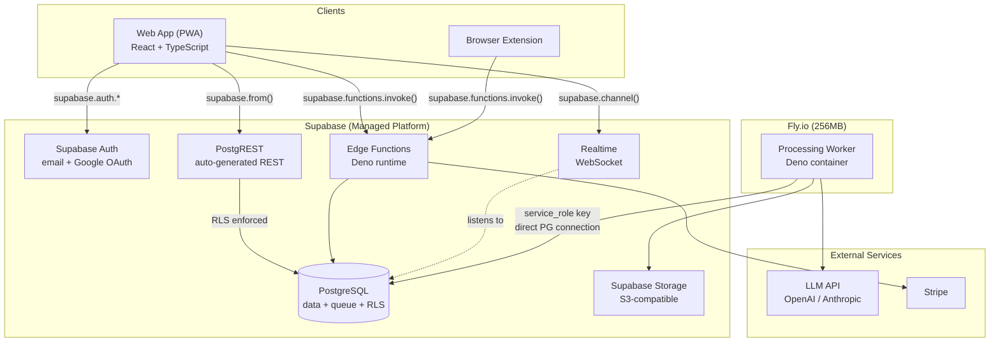
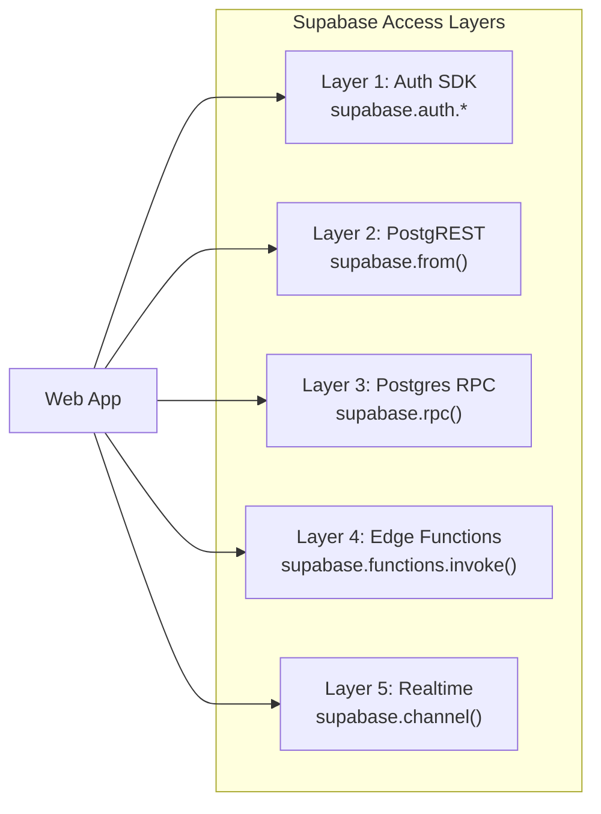
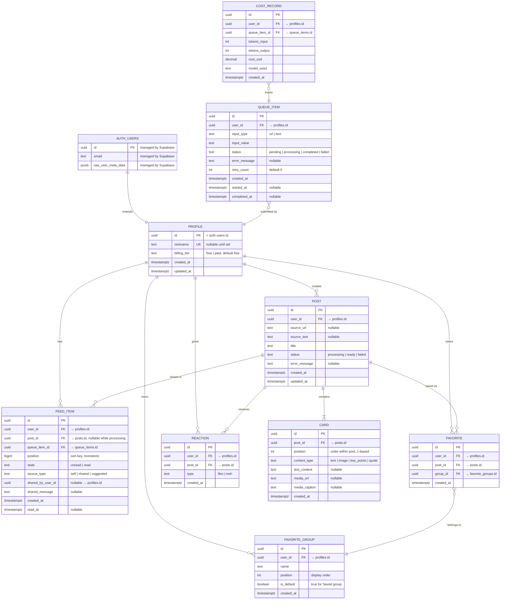
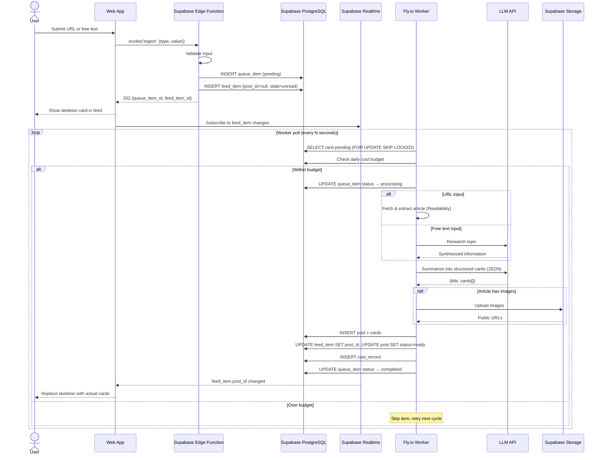
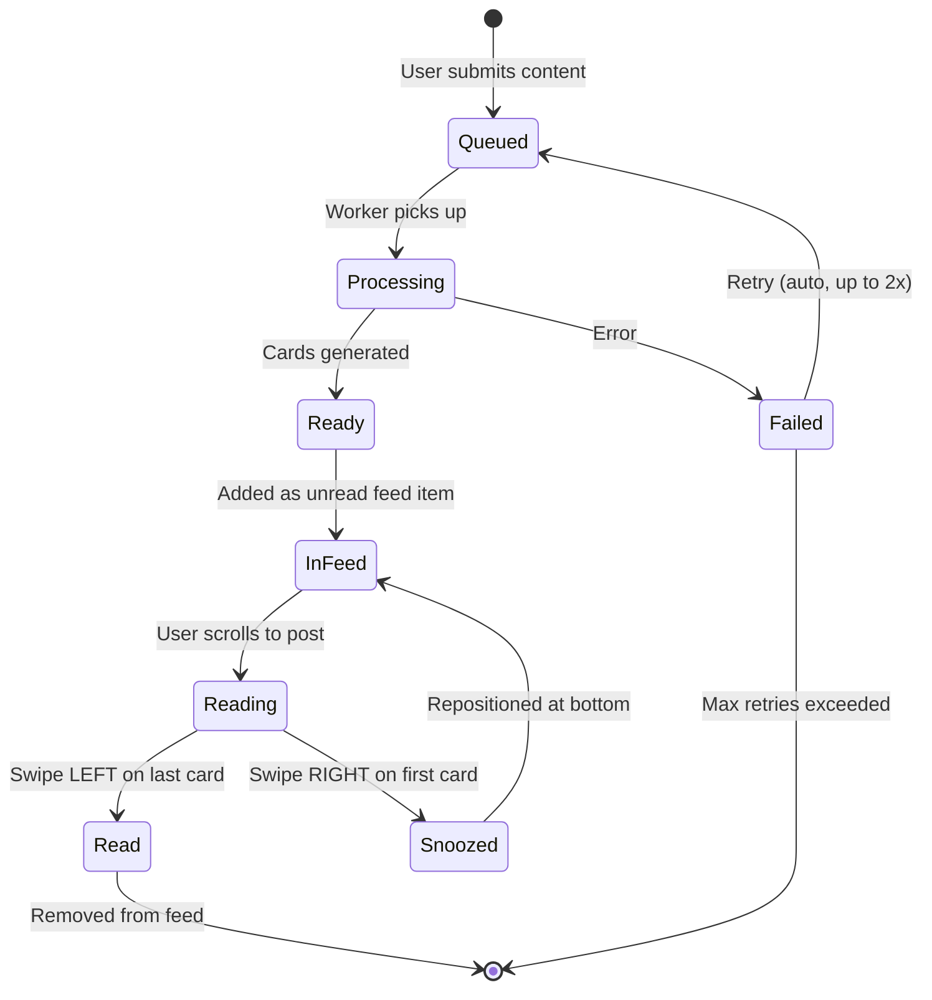
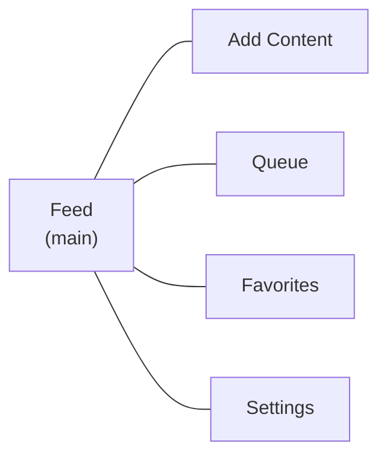
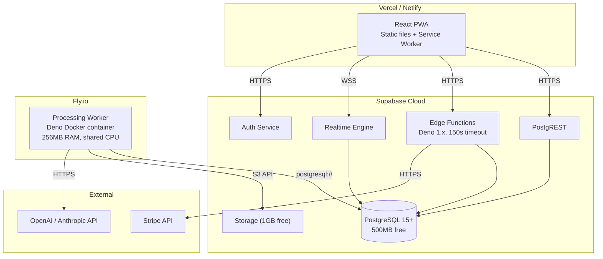

# BrainHeal — Application Specification

## 1. Overview

**BrainHeal** is a personal content reader that transforms bookmarked articles and topics into bite-sized, Instagram-style card feeds. It replaces the anxiety of accumulating bookmarks and the habit of doom-scrolling with a focused, self-curated reading experience.

### 1.1 Problem

People discover interesting content (articles, newsletters, recommendations) but lack time or energy to read it immediately. Bookmarks pile up, creating overwhelm, anxiety, and FOMO. Meanwhile, social media feeds fill idle moments with algorithmically-chosen content.

### 1.2 Solution

When a user finds something interesting, they send it to BrainHeal — a URL or a free-text topic. The app fetches and summarizes the content into short, readable **cards** grouped into **posts**. These appear in a deterministic, chronological feed the user controls completely.

### 1.3 Key Principles

- **User-curated**: All content is explicitly chosen by the user. No algorithmic surprises.
- **Deterministic feed**: The feed order is fixed (oldest-first) and never reshuffled.
- **Bite-sized reading**: Cards are concise — each readable in 10–30 seconds.
- **Explicit control**: Read/snooze states are controlled by deliberate gestures, not inferred.
- **Low friction**: Submitting content must be as easy as sharing a link.

---

## 2. Features

Features are grouped by priority tier.

### 2.1 Content Ingestion [Critical]

Users submit content to BrainHeal in two forms:


| Input type    | Description                                                                                         |
| ------------- | --------------------------------------------------------------------------------------------------- |
| **URL**       | A link to a web article. The app fetches and extracts the article body.                             |
| **Free text** | A topic or phrase (e.g., "Ralph Loop"). The app searches for information and synthesizes a summary. |


**Input channels** (by priority):


| Channel           | Priority | Platform         | Description                                                           |
| ----------------- | -------- | ---------------- | --------------------------------------------------------------------- |
| OS Share Sheet    | Critical | Mobile web (PWA) | Share a URL from any app directly to BrainHeal. Primary input method. |
| In-app input      | Critical | All              | Paste a URL or type free text within the app.                         |
| Browser extension | High     | Desktop          | Click an icon in the browser toolbar to send the current page.        |


**Behavior:**

- On submission, the item enters a processing queue. The user sees a success message. No need to overwhelm the user with processing details; this happens in the background.
- Duplicate URLs: no duplication detection for now.
- Invalid/unreachable URLs: error message in the ingestion history (separate screen in the app).
- The user can view their processing history and queue and see the status of each item.

### 2.2 Posts & Cards [Critical]

A **post** represents a single logical piece of ingested content. A **card** is one screen of information within a post.

**Posts:**

- One article typically produces one post.
- Long or multi-topic articles may produce multiple posts (decided by the LLM).
- Each post has a title (derived from the source).
- Posts track their source URL (if any), source text, and processing status.

**Cards:**

- A post contains 1–7 cards (soft limit, configurable globally).
- The **first card** contains the main idea / TL;DR.
- Subsequent cards elaborate: supporting details, examples, context, related info.
- Each card is concise: ~80–150 words of text (must fit on one screen).

**Card content types:**

- `text` — Formatted text (the primary type).
- `image` — An image extracted from the article, with an optional caption.
- `key_points` — A structured list of takeaways.
- `quote` — A notable quote from the source.

Cards do NOT support video embeds in MVP.

### 2.3 Feed [Critical]

The feed is the main screen of the app. It displays all unread posts in chronological order (oldest first).

**Properties:**

- **Deterministic**: The order never changes unless the user explicitly snoozes a post.
- **Oldest-first**: Ensures earlier content is consumed before newer content.
- **Unread-only**: Read posts disappear from the feed (accessible via Favorites if saved).

**Navigation:**

- **Vertical scroll**: Move between posts.
- **Horizontal swipe**: Move between cards within a post.

**Gestures:**


| Gesture          | Context                         | Effect                                            |
| ---------------- | ------------------------------- | ------------------------------------------------- |
| Swipe LEFT       | On the **last** card of a post  | Mark post as **read** → disappears from feed      |
| Swipe RIGHT      | On the **first** card of a post | **Snooze** → post moves to the bottom of the feed |
| Horizontal swipe | Between first and last card     | Navigate between cards                            |
| Vertical scroll  | Any card                        | Move to next/previous post                        |


**Processing indicator:** Posts still being processed appear in the feed with a skeleton/loading state showing their position in the queue.

**Realtime updates:** When the processing worker finishes generating cards for a post, the feed updates in realtime via Supabase Realtime (WebSocket subscription). The skeleton card is replaced with actual content without requiring a page refresh.

### 2.4 Accounts & Authentication [Critical]

Authentication is handled entirely by **Supabase Auth**. No custom auth backend.

**Registration & Login:**

- Email + password registration (Supabase Auth built-in).
- Third-party OAuth: Google, Apple (Supabase Auth providers).
- The process must be minimal — get the user into the app quickly.

**Client-side auth flow:**

- The frontend uses `@supabase/supabase-js` SDK for all auth operations.
- `supabase.auth.signUp()`, `supabase.auth.signInWithPassword()`, `supabase.auth.signInWithOAuth()`.
- JWT access tokens and refresh tokens are managed automatically by the Supabase SDK.
- The SDK stores the session in `localStorage` and refreshes tokens transparently.

**User profile:**

- Supabase manages `auth.users` (email, auth metadata). This table is not directly accessible to the app.
- A `profiles` table in the `public` schema extends the user with app-specific data (nickname, billing tier).
- A database trigger automatically creates a `profiles` row when a new `auth.users` row is inserted.

**Account holds:**

- Feed state (positions, read/unread).
- Favorites and groups.
- Reactions history.
- Preferences.
- Billing tier.

**Sessions:**

- JWT-based (managed by Supabase Auth).
- Access tokens: 1 hour (Supabase default). Refresh tokens: long-lived, rotated by SDK.
- Account accessible from any device (feed state syncs via Supabase).

### 2.5 Favorites [Medium]

Users can save posts to organized collections.

- **Default group**: "Saved" (always exists, cannot be deleted).
- **Custom groups**: User-created, one level deep (no nesting).
- **Save flow**: Tap "save" → immediately saved to "Saved" group → inline UI to pick/create a different group.
- A post can exist in one group only.
- Favorited posts persist even after being marked as read.

### 2.6 Reactions [Low]

Two reaction types:


| Reaction | Meaning                        | Used for                          |
| -------- | ------------------------------ | --------------------------------- |
| **Like** | "This was valuable"            | Recommendations (positive signal) |
| **Meh**  | "Not interested in this topic" | Recommendations (negative signal) |


- Reactions are mutually exclusive per post.
- Reactions can be changed or removed.

### 2.7 Recommendations [Low]

When the feed is empty (all content read), the app suggests new topics.

**Behavior:**

- Based on: liked posts (positive signal), meh'd posts (negative signal), topic history.
- Suggestions are **topic proposals**, NOT pre-generated posts. The user must explicitly tap to generate.
- Each suggestion includes a reason.

**Suggestion card format:**

```
[Topic title or question]

Because you were interested in [related topic].
```

- Suggestions are visually distinct from user-submitted content.
- Tapping a suggestion triggers the standard ingestion flow (as if the user typed the topic).

### 2.8 In-App Sharing [Extra-low]

- Share a post with another BrainHeal user by nickname.
- Recent share contacts are suggested.
- Shared posts appear in the recipient's feed, clearly marked with sender info and an optional message.
- Shared content is visually distinct (badge/label showing who shared it).

### 2.9 External Sharing [Low]

- Standard OS share sheet integration.
- Shared content includes: first card text + link to web view of the post.
- Web view is a public, read-only rendered version of the post (requires a public URL scheme).

### 2.10 Billing [Low]


| Tier     | Limits                         | Recommendations |
| -------- | ------------------------------ | --------------- |
| **Free** | N articles/month (TBD, ~30)    | No              |
| **Paid** | Higher limit (TBD, ~300/month) | Yes             |


- Details TBD. Payment via Stripe.
- Free tier should be generous enough to evaluate the app.
- Paid tier should cover comfortable daily use.

### 2.11 Search [Post-MVP]

Full-text search across the user's own posts and cards, including history. Prioritized for post-MVP. PostgreSQL full-text search (`tsvector`) is a natural fit since all data is already in Supabase PostgreSQL.

### 2.12 Offline Support [Post-MVP]

Cache loaded cards locally for offline reading. Prioritized for post-MVP.

---

## 3. Architecture

### 3.1 System Overview

The system is split between **Supabase** (managed platform) and **Fly.io** (processing worker). Supabase provides the database, auth, storage, API layer, and realtime subscriptions. Fly.io hosts the long-running processing worker that cannot run within Supabase Edge Functions' 150-second timeout.




### 3.2 Component Mapping


| Component             | Hosted on                                    | Notes                                                                                                                      |
| --------------------- | -------------------------------------------- | -------------------------------------------------------------------------------------------------------------------------- |
| **Web App (PWA)**     | Static hosting (Vercel / Netlify / Supabase) | React SPA. Registers as PWA Share Target. Communicates with Supabase via JS SDK.                                           |
| **Browser Extension** | Browser stores                               | Minimal. Calls a Supabase Edge Function to ingest URLs.                                                                    |
| **PostgreSQL**        | Supabase                                     | Primary data store + processing queue. Free tier: 500MB, 2 direct connections. RLS enforces data isolation.                |
| **Auth**              | Supabase Auth                                | Email/password + Google OAuth. JWT issued automatically. No custom auth code.                                              |
| **Object Storage**    | Supabase Storage                             | S3-compatible. Stores article images. Free tier: 1GB.                                                                      |
| **PostgREST API**     | Supabase                                     | Auto-generated REST API from the schema. Used for all reads and simple writes. RLS policies control access.                |
| **Edge Functions**    | Supabase                                     | Deno runtime (150s timeout). Used for operations with business logic: content ingestion, Stripe webhooks.                  |
| **Realtime**          | Supabase                                     | WebSocket push. Client subscribes to `feed_items` changes to get notified when posts are ready.                            |
| **Processing Worker** | Fly.io                                       | Always-on Deno container. Polls queue, fetches articles, calls LLM, creates posts/cards. ~$2–3/month (or free hobby tier). |
| **Admin Dashboard**   | Supabase Dashboard + custom queries          | MVP: use Supabase Dashboard's SQL editor and table view. Phase 2: custom admin UI.                                         |


### 3.3 Tech Stack


| Layer             | Technology                                     | Notes                                                                                 |
| ----------------- | ---------------------------------------------- | ------------------------------------------------------------------------------------- |
| Web frontend      | React + TypeScript + Vite                      | PWA with Web Share Target API. `@supabase/supabase-js` for all backend communication. |
| Browser extension | Vanilla JS                                     | Chrome Manifest V3. Calls Edge Function with Supabase anon key.                       |
| Database          | Supabase PostgreSQL                            | Primary store + queue. RLS policies for multi-tenant isolation.                       |
| Auth              | Supabase Auth                                  | Email/password + Google OAuth. Zero custom auth code.                                 |
| Object storage    | Supabase Storage                               | S3-compatible. Article images.                                                        |
| API (reads)       | Supabase PostgREST                             | Auto-generated. Client uses `supabase.from()`.                                        |
| API (mutations)   | Supabase Edge Functions (Deno)                 | Business logic: ingest, billing webhooks.                                             |
| API (atomic ops)  | PostgreSQL functions via RPC                   | `supabase.rpc()` for snooze, mark-read.                                               |
| Realtime          | Supabase Realtime                              | Push feed updates to clients.                                                         |
| Processing worker | Deno on Fly.io                                 | Long-running. Docker container. Direct PG connection with `service_role` key.         |
| LLM               | OpenAI or Anthropic API                        | Abstracted behind an interface. Cost/quality TBD.                                     |
| Payments          | Stripe                                         | Subscription billing via Edge Function webhook.                                       |
| Deployment        | Vercel (frontend) + Supabase + Fly.io (worker) |                                                                                       |


### 3.4 API Layer Design

The API is not a single monolithic backend. Instead, it is composed of four Supabase access patterns, each suited to different operation types:




| Layer              | Mechanism                     | Used for                                                    | Examples                                                                        |
| ------------------ | ----------------------------- | ----------------------------------------------------------- | ------------------------------------------------------------------------------- |
| **Auth SDK**       | `supabase.auth.`*             | All authentication                                          | Sign up, sign in, sign out, OAuth, session management                           |
| **PostgREST**      | `supabase.from().select()`    | All reads, simple inserts/updates                           | Fetch feed, fetch posts, list favorites, list queue items                       |
| **Postgres RPC**   | `supabase.rpc()`              | Atomic operations requiring transactions or computed values | Snooze (needs `max(position)+1`), mark as read                                  |
| **Edge Functions** | `supabase.functions.invoke()` | Complex business logic, external API calls                  | Content ingestion (validate + insert queue + insert feed item), Stripe webhooks |
| **Realtime**       | `supabase.channel().on()`     | Push notifications                                          | Feed item updates (processing → ready), queue status changes                    |


---

## 4. Data Model

### 4.1 Entity-Relationship Diagram




### 4.2 Supabase-Specific Schema Notes

`**auth.users` ↔ `profiles` pattern:** Supabase manages the `auth.users` table internally. The app creates a `profiles` table in the `public` schema, linked 1:1 via `profiles.id = auth.users.id`. A database trigger auto-creates a profile row on user signup:

```sql
CREATE OR REPLACE FUNCTION public.handle_new_user()
RETURNS trigger AS $$
BEGIN
  INSERT INTO public.profiles (id)
  VALUES (NEW.id);
  RETURN NEW;
END;
$$ LANGUAGE plpgsql SECURITY DEFINER;

CREATE TRIGGER on_auth_user_created
  AFTER INSERT ON auth.users
  FOR EACH ROW
  EXECUTE FUNCTION public.handle_new_user();
```

**Default "Saved" group:** A second trigger creates the default favorite group when a profile is created:

```sql
CREATE OR REPLACE FUNCTION public.handle_new_profile()
RETURNS trigger AS $$
BEGIN
  INSERT INTO public.favorite_groups (user_id, name, position, is_default)
  VALUES (NEW.id, 'Saved', 0, true);
  RETURN NEW;
END;
$$ LANGUAGE plpgsql SECURITY DEFINER;

CREATE TRIGGER on_profile_created
  AFTER INSERT ON public.profiles
  FOR EACH ROW
  EXECUTE FUNCTION public.handle_new_profile();
```

### 4.3 Key Design Decisions

**Feed ordering:** `FEED_ITEM.position` is a monotonically increasing `bigint`. New items get `max(position) + 1` for that user. Snoozing sets position to `max(position) + 1`, moving the post to the bottom. Feed query: `WHERE state = 'unread' ORDER BY position ASC`.

**Feed item ↔ Queue item linkage:** A `feed_item` is created at ingestion time (with `post_id = NULL`) so the user immediately sees a placeholder in the feed. When the worker completes processing, it sets `feed_item.post_id` to the newly created post. The client detects this change via Supabase Realtime and renders the cards.

**Queue as table:** The `queue_items` table doubles as the processing queue. The Fly.io worker uses `SELECT ... WHERE status = 'pending' ORDER BY created_at ASC LIMIT 1 FOR UPDATE SKIP LOCKED` to claim work without contention. This allows horizontal scaling of workers if needed.

**Soft deletes:** Posts marked as "read" remain in the database (for favorites, reactions, and future search). Only `FEED_ITEM.state` changes to `'read'`.

### 4.4 Row Level Security (RLS) Policies

All tables in the `public` schema have RLS enabled. Users can only access their own data. The Fly.io worker uses the `service_role` key, which bypasses RLS.


| Table             | SELECT             | INSERT             | UPDATE                  | DELETE                 |
| ----------------- | ------------------ | ------------------ | ----------------------- | ---------------------- |
| `profiles`        | Own row only       | Auto (trigger)     | Own row only            | —                      |
| `posts`           | Own posts          | — (worker creates) | —                       | Own posts              |
| `cards`           | Cards of own posts | — (worker creates) | —                       | —                      |
| `feed_items`      | Own items          | — (edge function)  | Own items (read/snooze) | Own items              |
| `queue_items`     | Own items          | — (edge function)  | —                       | Own pending items      |
| `favorite_groups` | Own groups         | Own groups         | Own groups              | Own non-default groups |
| `favorites`       | Own favorites      | Own favorites      | —                       | Own favorites          |
| `reactions`       | Own reactions      | Own reactions      | Own reactions           | Own reactions          |
| `cost_records`    | Own records        | — (worker creates) | —                       | —                      |


RLS policy pattern (example for `feed_items`):

```sql
ALTER TABLE feed_items ENABLE ROW LEVEL SECURITY;

CREATE POLICY "Users can view their own feed items"
  ON feed_items FOR SELECT
  USING (auth.uid() = user_id);

CREATE POLICY "Users can update their own feed items"
  ON feed_items FOR UPDATE
  USING (auth.uid() = user_id);
```

---

## 5. Content Processing Pipeline

### 5.1 Ingestion Flow




### 5.2 Card Generation

The LLM receives a structured prompt with the article content and generates a JSON response.

**Prompt structure (conceptual):**

```
You are a content summarizer for a reading app. Given an article,
produce a JSON object with a post title and an array of cards.

Rules:
- First card: the main idea / TL;DR (most important takeaway).
- Subsequent cards: supporting details, examples, context.
- Each card: 80–150 words, concise and self-contained.
- Produce 2–7 cards depending on article length and complexity.
- Use card types: "text", "key_points", "quote".
- If the article contains notable quotes, include one as a "quote" card.
- If there are clear takeaways, include a "key_points" card.

Article:
---
{article_content}
---

Respond with JSON only:
{
  "title": "...",
  "cards": [
    { "type": "text", "content": "..." },
    { "type": "key_points", "items": ["...", "..."] },
    { "type": "quote", "content": "...", "attribution": "..." }
  ]
}
```

**Image handling:** Images referenced in the article are extracted by the scraper, uploaded to Supabase Storage, and attached as `image`-type cards or inline references in text cards. Supabase Storage provides public URLs for the uploaded images.

**Free text handling:** When the input is free text rather than a URL, the LLM first performs a search/synthesis step to gather information about the topic, then generates cards from that synthesized content. This is a two-step LLM call.

### 5.3 Error Handling


| Scenario                          | Handling                                                                          |
| --------------------------------- | --------------------------------------------------------------------------------- |
| URL unreachable / 404             | Retry once after 5 min. If still failing, mark as `failed`, update feed item.     |
| Paywall / insufficient content    | Mark as `failed` with message "Could not access full article (possible paywall)". |
| LLM API error                     | Retry once. If failing, mark as `failed`.                                         |
| LLM returns malformed JSON        | Retry with stricter prompt. If still failing, mark as `failed`.                   |
| Article too short (<50 words)     | Generate a single-card post.                                                      |
| Article very long (>10,000 words) | Truncate to first ~8,000 words with note. Consider splitting into multiple posts. |


Max retries per queue item: **2**. After exhausting retries, status → `failed`. Failed items show an error state in the feed (user can retry or dismiss).

### 5.4 Cost Management

Each user account has a monthly LLM budget (determined by billing tier).

**Budget calculation:**

```
remaining_budget = monthly_budget - sum(costs this month) + unused_carryover
daily_limit = remaining_budget / remaining_days_in_month
```

**Example:** Monthly budget is $10. It's day 20 of a 30-day month. $5 spent so far this month, $3 carried over from last month. Remaining budget = ($10 + $3) − $5 = $8. Days left = 10. Daily limit = $8 / 10 = **$0.80/day**.

**Enforcement:**

- Before processing each queue item, the worker checks if `sum(today's costs) < daily_limit`.
- If over budget, the item stays in `pending` state until the next day.
- User is notified in the app: "Daily processing limit reached. Your content will be processed tomorrow."

**Cost tracking:**

- Every LLM call records: tokens in, tokens out, model used, cost in USD.
- Costs are per-user, per-queue-item.
- Admin can view aggregate cost metrics via Supabase Dashboard SQL queries.

---

## 6. API Design

### 6.1 Authentication (Supabase Auth SDK)

All auth is handled client-side via the Supabase JS SDK. No custom auth endpoints.


| Operation      | Client Code                                             |
| -------------- | ------------------------------------------------------- |
| Register       | `supabase.auth.signUp({ email, password })`             |
| Login (email)  | `supabase.auth.signInWithPassword({ email, password })` |
| Login (Google) | `supabase.auth.signInWithOAuth({ provider: 'google' })` |
| Login (Apple)  | `supabase.auth.signInWithOAuth({ provider: 'apple' })`  |
| Logout         | `supabase.auth.signOut()`                               |
| Get session    | `supabase.auth.getSession()`                            |
| Get user       | `supabase.auth.getUser()`                               |


The SDK automatically manages JWTs, refresh tokens, and session persistence in `localStorage`.

### 6.2 Data Reads (PostgREST via SDK)

All reads go through `supabase.from()`, which calls Supabase PostgREST. RLS policies enforce per-user data isolation.

**Feed (unread, oldest first, paginated):**

```typescript
const { data } = await supabase
  .from('feed_items')
  .select(`
    id, position, state, source_type, shared_by_user_id, shared_message,
    queue_item:queue_items(status, error_message),
    post:posts(
      id, title, status, source_url, error_message,
      cards(id, position, content_type, text_content, media_url, media_caption)
    )
  `)
  .eq('state', 'unread')
  .order('position', { ascending: true })
  .range(0, 19);
```

**Queue items:**

```typescript
const { data } = await supabase
  .from('queue_items')
  .select('*')
  .order('created_at', { ascending: false });
```

**Favorites (groups with posts):**

```typescript
const { data } = await supabase
  .from('favorite_groups')
  .select(`
    id, name, position, is_default,
    favorites(id, post:posts(id, title, source_url, cards(id, position, content_type, text_content)))
  `)
  .order('position', { ascending: true });
```

**Single post:**

```typescript
const { data } = await supabase
  .from('posts')
  .select('*, cards(*)')
  .eq('id', postId)
  .single();
```

### 6.3 Atomic Operations (Postgres RPC)

Operations that need transactions or computed values use Postgres functions called via `supabase.rpc()`.

**Snooze a feed item** (move to bottom):

```sql
CREATE OR REPLACE FUNCTION snooze_feed_item(item_id uuid)
RETURNS void
LANGUAGE plpgsql
SECURITY DEFINER
AS $$
BEGIN
  UPDATE feed_items
  SET position = (
    SELECT COALESCE(MAX(position), 0) + 1
    FROM feed_items
    WHERE user_id = auth.uid()
  )
  WHERE id = item_id AND user_id = auth.uid();
END;
$$;
```

Client call:

```typescript
await supabase.rpc('snooze_feed_item', { item_id: feedItemId });
```

**Mark feed item as read:**

```sql
CREATE OR REPLACE FUNCTION mark_feed_item_read(item_id uuid)
RETURNS void
LANGUAGE plpgsql
SECURITY DEFINER
AS $$
BEGIN
  UPDATE feed_items
  SET state = 'read', read_at = now()
  WHERE id = item_id AND user_id = auth.uid();
END;
$$;
```

Client call:

```typescript
await supabase.rpc('mark_feed_item_read', { item_id: feedItemId });
```

### 6.4 Business Logic (Edge Functions)

Complex operations that involve multiple steps, validation, or external API calls use Supabase Edge Functions (Deno runtime, 150s timeout).

`**ingest` — Submit content for processing:**

```typescript
// Client call
const { data, error } = await supabase.functions.invoke('ingest', {
  body: { type: 'url', value: 'https://example.com/article' }
});
```

Edge Function logic:

1. Validate input (URL format, text length).
2. Get the user from the JWT (passed automatically by the SDK).
3. Check if user has available quota (optional in MVP).
4. INSERT into `queue_items` (status: `pending`).
5. Compute next feed position: `max(position) + 1` for this user.
6. INSERT into `feed_items` (post_id: `null`, state: `unread`, queue_item_id: new queue item).
7. Return `{ queue_item_id, feed_item_id }`.

`**stripe-webhook` — Handle Stripe events (Phase 2):**

Edge Function logic:

1. Verify Stripe webhook signature.
2. Handle `checkout.session.completed`, `customer.subscription.updated`, etc.
3. Update `profiles.billing_tier` accordingly.

### 6.5 Realtime Subscriptions

The client subscribes to database changes to get live updates without polling.

**Feed updates (processing → ready):**

```typescript
supabase
  .channel('feed-updates')
  .on(
    'postgres_changes',
    {
      event: 'UPDATE',
      schema: 'public',
      table: 'feed_items',
      filter: `user_id=eq.${userId}`,
    },
    (payload) => {
      // feed_item was updated (e.g., post_id set, or queue status changed)
      // refresh the affected feed item in the UI
    }
  )
  .subscribe();
```

This replaces the need for polling or push notifications in the web MVP. When the Fly.io worker finishes processing and updates the `feed_item`, the client receives the change in realtime.

### 6.6 Simple Writes (PostgREST)

Simple inserts and deletes that don't need business logic go directly through PostgREST. RLS ensures users can only modify their own data.

**Save to favorites:**

```typescript
await supabase.from('favorites').insert({
  user_id: userId,
  post_id: postId,
  group_id: groupId ?? defaultGroupId,
});
```

**Remove from favorites:**

```typescript
await supabase.from('favorites').delete().eq('id', favoriteId);
```

**Add reaction:**

```typescript
await supabase.from('reactions').upsert(
  { user_id: userId, post_id: postId, type: 'like' },
  { onConflict: 'user_id,post_id' }
);
```

**Remove reaction:**

```typescript
await supabase.from('reactions').delete().match({ user_id: userId, post_id: postId });
```

**Create favorite group:**

```typescript
await supabase.from('favorite_groups').insert({
  user_id: userId,
  name: 'Tech Articles',
  position: nextPosition,
  is_default: false,
});
```

**Delete post (and cascade to feed item):**

```typescript
await supabase.from('posts').delete().eq('id', postId);
```

### 6.7 Admin Access

For MVP, admin operations use the **Supabase Dashboard** directly:

- SQL editor for ad-hoc queries (queue depth, cost reports, user stats).
- Table editor for managing data.
- Auth dashboard for managing users.
- Logs for Edge Function and Realtime debugging.

Phase 2: Custom admin UI if needed, using the `service_role` key (bypasses RLS).

---

## 7. UX & Screens

### 7.1 Screen Map


| Screen                 | Description                                                   | Priority |
| ---------------------- | ------------------------------------------------------------- | -------- |
| **Login / Register**   | Auth flow via Supabase Auth UI or custom form. Minimal steps. | Critical |
| **Feed**               | Main screen. Vertical post scroll, horizontal card swipe.     | Critical |
| **Add Content**        | Input field for URL or text. Accessible via FAB or nav.       | Critical |
| **Processing Queue**   | List of submitted items with status indicators.               | Critical |
| **Favorites**          | Groups sidebar + post list.                                   | Medium   |
| **Settings / Profile** | Account info, nickname, preferences, billing.                 | Medium   |
| **Recommendations**    | Shown at the end of the feed when all content is read.        | Low      |


### 7.2 Feed UX Detail




**Feed card layout (conceptual):**

```
┌─────────────────────────────┐
│  ← Card 1 of 5 →           │  ← horizontal position indicator
│                             │
│  [Card content area]        │
│  80–150 words of text       │
│  or image with caption      │
│                             │
│                             │
├─────────────────────────────┤
│  ♡  ↗  ★                   │  ← react, share, favorite
│  "Article Title" · source   │
└─────────────────────────────┘
```

- Cards take up the full viewport height (minus navigation chrome).
- Horizontal dots/indicator shows position within the post.
- Action buttons (react, share, favorite) are persistent at the bottom.
- Source URL/topic shown as a subtle footer.

### 7.3 Navigation




Bottom navigation bar with 4 tabs: **Feed** (home), **Favorites**, **Queue**, **Settings**. The "Add Content" action is a floating action button (FAB) overlaying the feed, or accessible from the Queue screen.

---

## 8. Non-Functional Requirements

### 8.1 Performance

- Feed loads within 2 seconds on 3G connections.
- Card transitions (swipe) are 60fps with no jank.
- Supabase PostgREST response times: p95 < 200ms for read operations.
- Edge Function cold start: < 500ms (Deno on Supabase is fast, but first invocation may be slower).

### 8.2 Security

- All communication over HTTPS (enforced by Supabase and Fly.io).
- Passwords hashed by Supabase Auth (bcrypt, handled internally).
- JWT access tokens: 1 hour (Supabase default). Refresh tokens: long-lived, rotated by SDK.
- **Row Level Security (RLS)** on all `public` tables — every query is scoped to `auth.uid()`. This is the primary multi-tenant isolation mechanism.
- The Fly.io worker uses the `service_role` key (bypasses RLS) since it operates on behalf of the system, not a specific user. This key must never be exposed to clients.
- Supabase anon key (public, safe to embed in frontend) + RLS = secure by default.
- Input sanitization on all user-provided content (URLs, text) in Edge Functions.
- API rate limiting: handled by Supabase (default rate limits apply).

### 8.3 Scalability

- **MVP target**: ~100 users, ~1,000 posts/day processing capacity.
- Supabase free tier: 500MB database, 1GB storage, 500K Edge Function invocations/month. Sufficient for MVP.
- PostgreSQL queue is sufficient at this scale. The `SKIP LOCKED` pattern allows multiple workers if needed.
- Fly.io: single 256MB machine. Can scale to multiple machines with the same queue pattern.
- Supabase Realtime: handles connection fan-out. No custom WebSocket server needed.

### 8.4 Monitoring & Observability

- Supabase Dashboard: database metrics, auth logs, Edge Function logs, Realtime metrics.
- Fly.io: container logs, health checks, metrics.
- Structured JSON logging in the Fly.io worker (processing times, costs, errors).
- Health check endpoint on the Fly.io worker for uptime monitoring.

---

## 9. MVP Scope

The MVP is a **mobile-first web app (PWA)** backed by **Supabase** + **Fly.io worker**.


| Feature                                    | Included in MVP |
| ------------------------------------------ | --------------- |
| In-app content submission (URL + text)     | Yes             |
| OS Share Sheet (PWA share target)          | Yes             |
| Content processing (fetch + LLM summarize) | Yes             |
| Card feed with swipe navigation            | Yes             |
| Read / snooze gestures                     | Yes             |
| Email + password auth (Supabase Auth)      | Yes             |
| OAuth — Google (Supabase Auth)             | Yes             |
| Realtime feed updates (Supabase Realtime)  | Yes             |
| Processing queue view                      | Yes             |
| Favorites with groups                      | Yes             |
| Browser extension                          | Phase 2         |
| Reactions (like/meh)                       | Phase 2         |
| Recommendations                            | Phase 3         |
| In-app sharing                             | Phase 3         |
| External sharing                           | Phase 3         |
| Billing / Stripe                           | Phase 2         |
| Search (PG full-text)                      | Phase 2         |
| Offline support                            | Phase 2         |
| iOS native app                             | Phase 3         |


---

## 10. Open Questions & Decisions


| #   | Question                                                                                                                                                                                       | Impact                     | Status                                                                    |
| --- | ---------------------------------------------------------------------------------------------------------------------------------------------------------------------------------------------- | -------------------------- | ------------------------------------------------------------------------- |
| 1   | **LLM provider**: OpenAI vs Anthropic?                                                                                                                                                         | Cost, quality, latency     | Needs evaluation                                                          |
| 2   | **Free tier limits**: How many articles/month?                                                                                                                                                 | Business model             | TBD                                                                       |
| 3   | **Paid tier pricing**: Monthly cost? Article limits?                                                                                                                                           | Business model             | TBD                                                                       |
| 4   | **Card text formatting**: Plain text, markdown, or limited rich text?                                                                                                                          | Frontend complexity        | Markdown                                                                  |
| 5   | **PWA Share Target**: Requires HTTPS + service worker + manifest. Confirm this meets "share sheet" expectation or if a native wrapper (e.g., Capacitor) is needed for reliable mobile sharing. | UX of primary input method | Needs validation                                                          |
| 6   | **Budget carryover cap**: Should unused budget accumulate indefinitely or cap at N months?                                                                                                     | Cost risk                  | Budget accumulates within one month (billing period). Resets every month. |
| 7   | **Multi-post splitting**: Should the LLM autonomously split a long article into multiple posts, or always produce one post?                                                                    | UX complexity              | LLM decides. Instructions and suggestions are in the system prompt.       |
| 8   | **Supabase plan**: Free tier has limits (500MB DB, 50K auth users, 500K Edge Function invocations). When to upgrade to Pro ($25/month)?                                                        | Cost planning              | Monitor usage                                                             |
| 9   | **Worker polling interval**: How often should the Fly.io worker poll the queue? Tradeoff: latency vs DB load.                                                                                  | Processing speed vs cost   | Start with 5s                                                             |
| 10  | **Supabase Realtime for queue status**: Should the queue/history screen also use Realtime subscriptions, or is polling sufficient there?                                                       | UX polish                  | Polling is ok                                                             |


---

## Appendix A: Deployment Topology




**Cost estimate (MVP):**


| Service          | Tier                 | Monthly cost              |
| ---------------- | -------------------- | ------------------------- |
| Supabase         | Free                 | $0                        |
| Fly.io           | Hobby (256MB shared) | $0–3                      |
| Vercel / Netlify | Free                 | $0                        |
| LLM API          | Pay-per-use          | ~$5–20 (depends on usage) |
| **Total**        |                      | **~$5–23/month**          |


