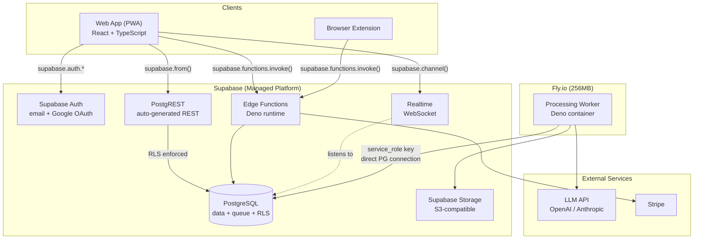
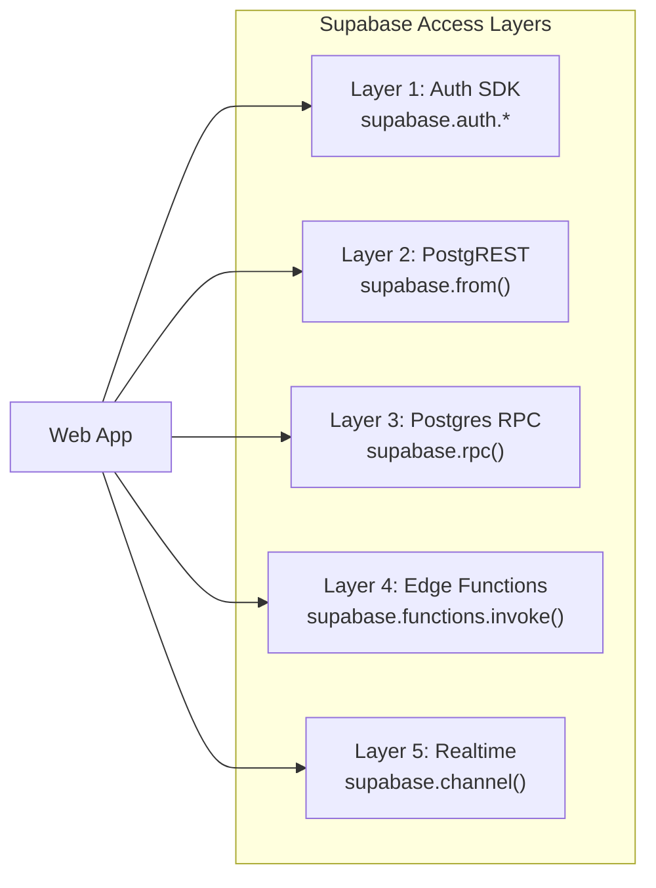
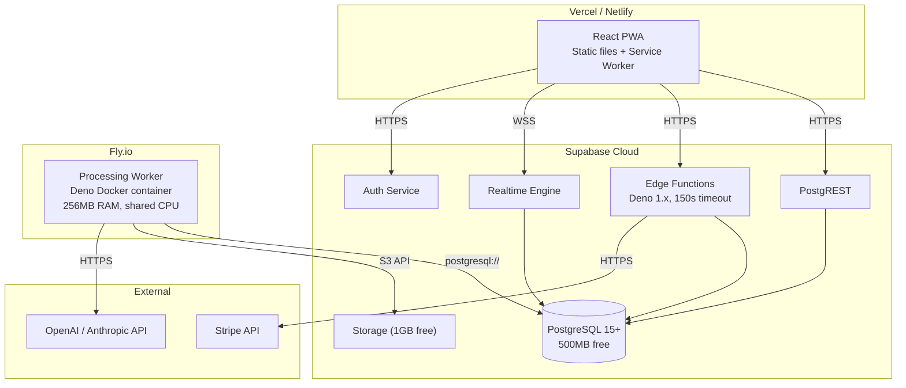

# BrainHeal — Architecture

## 1. System Overview

The system is split between **Supabase** (managed platform) and **Fly.io** (processing worker). Supabase provides the database, auth, storage, API layer, and realtime subscriptions. Fly.io hosts the long-running processing worker that cannot run within Supabase Edge Functions' 150-second timeout.

---

## 2. Component Mapping

| Component             | Hosted on                                    | Notes                                                                                                                      |
| --------------------- | -------------------------------------------- | -------------------------------------------------------------------------------------------------------------------------- |
| **Web App (PWA)**     | Static hosting (Vercel / Netlify / Supabase) | React SPA. Registers as PWA Share Target. Communicates with Supabase via JS SDK.                                           |
| **Browser Extension** | Browser stores                               | Minimal. Calls a Supabase Edge Function to ingest URLs.                                                                    |
| **PostgreSQL**        | Supabase                                     | Primary data store + processing queue. Free tier: 500MB, 2 direct connections. RLS enforces data isolation.                |
| **Auth**              | Supabase Auth                                | Email/password + Google OAuth. JWT issued automatically. No custom auth code.                                              |
| **Object Storage**    | Supabase Storage                             | S3-compatible. Stores article images. Free tier: 1GB.                                                                      |
| **PostgREST API**     | Supabase                                     | Auto-generated REST API from the schema. Used for all reads and simple writes. RLS policies control access.                |
| **Edge Functions**    | Supabase                                     | Deno runtime (150s timeout). Used for operations with business logic: content ingestion, Stripe webhooks.                  |
| **Realtime**          | Supabase                                     | WebSocket push. Client subscribes to `feed_items` changes to get notified when posts are ready.                            |
| **Processing Worker** | Fly.io                                       | Always-on Deno container. Polls queue, fetches articles, calls LLM, creates posts/cards. ~$2–3/month (or free hobby tier). |
| **Admin Dashboard**   | Supabase Dashboard + custom queries          | MVP: use Supabase Dashboard's SQL editor and table view. Phase 2: custom admin UI.                                         |

---

## 3. Tech Stack

| Layer             | Technology                                     | Notes                                                                                 |
| ----------------- | ---------------------------------------------- | ------------------------------------------------------------------------------------- |
| Web frontend      | React + TypeScript + Vite (Deno 2.7)           | PWA with Web Share Target API. `@supabase/supabase-js` for all backend communication. Scaffolded with `deno init --npm vite`. |
| Backend API       | Hono (all members)                             | Single HTTP framework across frontend API server, worker, and Edge Functions. No Oak/Express. |
| Browser extension | Vanilla JS                                     | Chrome Manifest V3. Calls Edge Function with Supabase anon key.                       |
| Database          | Supabase PostgreSQL                            | Primary store + queue. RLS policies for multi-tenant isolation.                       |
| Auth              | Supabase Auth                                  | Email/password + Google OAuth. Zero custom auth code.                                 |
| Object storage    | Supabase Storage                               | S3-compatible. Article images.                                                        |
| API (reads)       | Supabase PostgREST                             | Auto-generated. Client uses `supabase.from()`.                                        |
| API (mutations)   | Supabase Edge Functions (Deno 2.7)             | Business logic: ingest, billing webhooks. Hono app wrapped for Supabase `serve()`.    |
| API (atomic ops)  | PostgreSQL functions via RPC                   | `supabase.rpc()` for snooze, mark-read.                                               |
| Realtime          | Supabase Realtime                              | Push feed updates to clients.                                                         |
| Processing worker | Deno 2.7 on Fly.io                             | Long-running. Docker container. Direct PG connection with `service_role` key.         |
| Workspace         | Deno 2.7 workspaces (root `deno.json`)         | Single lockfile. JSR/npm specifiers only — no raw `https://` imports.                 |
| LLM               | OpenAI or Anthropic API                        | Abstracted behind an interface. Cost/quality TBD.                                     |
| Payments          | Stripe                                         | Subscription billing via Edge Function webhook.                                       |
| Deployment        | Vercel (frontend) + Supabase + Fly.io (worker) |                                                                                       |

---

## 4. API Layer Design

The API is not a single monolithic backend. Instead, it is composed of four Supabase access patterns, each suited to different operation types:

| Layer              | Mechanism                     | Used for                                                    | Examples                                                                        |
| ------------------ | ----------------------------- | ----------------------------------------------------------- | ------------------------------------------------------------------------------- |
| **Auth SDK**       | `supabase.auth.*`             | All authentication                                          | Sign up, sign in, sign out, OAuth, session management                           |
| **PostgREST**      | `supabase.from().select()`    | All reads, simple inserts/updates                           | Fetch feed, fetch posts, list favorites, list queue items                       |
| **Postgres RPC**   | `supabase.rpc()`              | Atomic operations requiring transactions or computed values | Snooze (needs `max(position)+1`), mark as read                                  |
| **Edge Functions** | `supabase.functions.invoke()` | Complex business logic, external API calls                  | Content ingestion (validate + insert queue + insert feed item), Stripe webhooks |
| **Realtime**       | `supabase.channel().on()`     | Push notifications                                          | Feed item updates (processing → ready), queue status changes                    |

---

## 5. Deployment Topology

**Cost estimate (MVP):**

| Service          | Tier                 | Monthly cost              |
| ---------------- | -------------------- | ------------------------- |
| Supabase         | Free                 | $0                        |
| Fly.io           | Hobby (256MB shared) | $0–3                      |
| Vercel / Netlify | Free                 | $0                        |
| LLM API          | Pay-per-use          | ~$5–20 (depends on usage) |
| **Total**        |                      | **~$5–23/month**          |

---

## 6. Non-Functional Requirements

### Performance

- Feed loads within 2 seconds on 3G connections.
- Card transitions (swipe) are 60fps with no jank.
- Supabase PostgREST response times: p95 < 200ms for read operations.
- Edge Function cold start: < 500ms (Deno on Supabase is fast, but first invocation may be slower).

### Security

- All communication over HTTPS (enforced by Supabase and Fly.io).
- Passwords hashed by Supabase Auth (bcrypt, handled internally).
- JWT access tokens: 1 hour (Supabase default). Refresh tokens: long-lived, rotated by SDK.
- **Row Level Security (RLS)** on all `public` tables — every query is scoped to `auth.uid()`. This is the primary multi-tenant isolation mechanism.
- The Fly.io worker uses the `service_role` key (bypasses RLS) since it operates on behalf of the system, not a specific user. This key must never be exposed to clients.
- Supabase anon key (public, safe to embed in frontend) + RLS = secure by default.
- Input sanitization on all user-provided content (URLs, text) in Edge Functions.
- API rate limiting: handled by Supabase (default rate limits apply).

### Scalability

- **MVP target**: ~100 users, ~1,000 posts/day processing capacity.
- Supabase free tier: 500MB database, 1GB storage, 500K Edge Function invocations/month. Sufficient for MVP.
- PostgreSQL queue is sufficient at this scale. The `SKIP LOCKED` pattern allows multiple workers if needed.
- Fly.io: single 256MB machine. Can scale to multiple machines with the same queue pattern.
- Supabase Realtime: handles connection fan-out. No custom WebSocket server needed.

### Monitoring & Observability

- Supabase Dashboard: database metrics, auth logs, Edge Function logs, Realtime metrics.
- Fly.io: container logs, health checks, metrics.
- Structured JSON logging in the Fly.io worker (processing times, costs, errors).
- Health check endpoint on the Fly.io worker for uptime monitoring.
