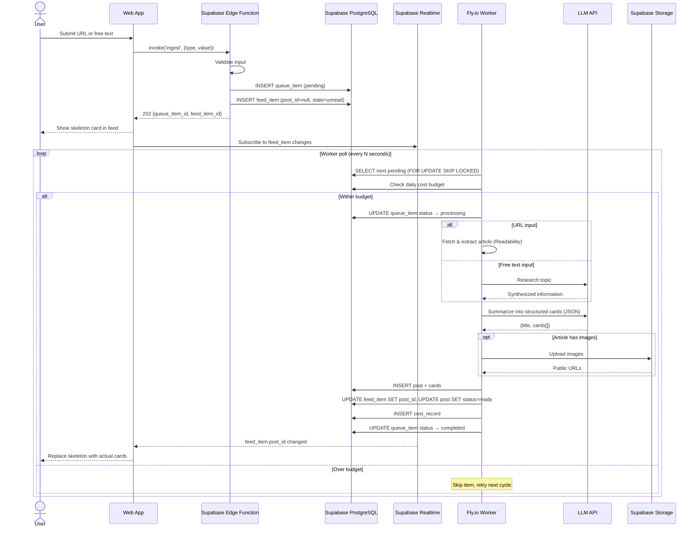

# BrainHeal — Content Ingestion & Processing Pipeline

## 1. Content Ingestion

Users submit content to BrainHeal in two forms:

| Input type    | Description                                                                                         |
| ------------- | --------------------------------------------------------------------------------------------------- |
| **URL**       | A link to a web article. The app fetches and extracts the article body.                             |
| **Free text** | A topic or phrase (e.g., "Ralph Loop"). The app searches for information and synthesizes a summary. |

**Input channels** (by priority):

| Channel           | Priority | Platform         | Description                                                           |
| ----------------- | -------- | ---------------- | --------------------------------------------------------------------- |
| OS Share Sheet    | Critical | Mobile web (PWA) | Share a URL from any app directly to BrainHeal. Primary input method. |
| In-app input      | Critical | All              | Paste a URL or type free text within the app.                         |
| Browser extension | High     | Desktop          | Click an icon in the browser toolbar to send the current page.        |

**Behavior:**

- On submission, the item enters a processing queue. The user sees a success message immediately.
- Duplicate URLs: no duplication detection for now.
- Invalid/unreachable URLs: error message shown in the processing queue screen.
- The user can view their processing history and queue with the status of each item.

---

## 2. Ingestion Flow (Sequence)



### Edge Function: `ingest`

Client call:

```typescript
const { data, error } = await supabase.functions.invoke('ingest', {
  body: { type: 'url', value: 'https://example.com/article' }
});
```

Edge Function steps:

1. Validate input (URL format, text length).
2. Get the user from the JWT (passed automatically by the SDK).
3. Check if user has available quota (optional in MVP).
4. INSERT into `queue_items` (status: `pending`).
5. Compute next feed position: `max(position) + 1` for this user.
6. INSERT into `feed_items` (post_id: `null`, state: `unread`, queue_item_id: new queue item).
7. Return `{ queue_item_id, feed_item_id }`.

---

## 3. Card Generation

The LLM receives a structured prompt with the article content and generates a JSON response.

**Prompt structure (conceptual):**

```
You are a content summarizer for a reading app. Given an article,
produce a JSON object with a post title and an array of cards.

Rules:
- First card: the main idea / TL;DR (most important takeaway).
- Subsequent cards: supporting details, examples, context.
- Each card: 80–150 words, concise and self-contained.
- Produce 2–7 cards depending on article length and complexity.
- Use card types: "text", "key_points", "quote".
- If the article contains notable quotes, include one as a "quote" card.
- If there are clear takeaways, include a "key_points" card.

Article:
---
{article_content}
---

Respond with JSON only:
{
  "title": "...",
  "cards": [
    { "type": "text", "content": "..." },
    { "type": "key_points", "items": ["...", "..."] },
    { "type": "quote", "content": "...", "attribution": "..." }
  ]
}
```

**Image handling:** Images referenced in the article are extracted by the scraper, uploaded to Supabase Storage, and attached as `image`-type cards or inline references in text cards. Supabase Storage provides public URLs for the uploaded images.

**Free text handling:** When the input is free text rather than a URL, the LLM first performs a search/synthesis step to gather information about the topic, then generates cards from that synthesized content. This is a two-step LLM call.

---

## 4. Error Handling

| Scenario                          | Handling                                                                          |
| --------------------------------- | --------------------------------------------------------------------------------- |
| URL unreachable / 404             | Retry once after 5 min. If still failing, mark as `failed`, update feed item.     |
| Paywall / insufficient content    | Mark as `failed` with message "Could not access full article (possible paywall)". |
| LLM API error                     | Retry once. If failing, mark as `failed`.                                         |
| LLM returns malformed JSON        | Retry with stricter prompt. If still failing, mark as `failed`.                   |
| Article too short (<50 words)     | Generate a single-card post.                                                      |
| Article very long (>10,000 words) | Truncate to first ~8,000 words with note. Consider splitting into multiple posts. |

Max retries per queue item: **2**. After exhausting retries, status → `failed`. Failed items show an error state in the feed (user can retry or dismiss).

---

## 5. Cost Management

Each user account has a monthly LLM budget (determined by billing tier).

**Budget calculation:**

```
remaining_budget = monthly_budget - sum(costs this month) + unused_carryover
daily_limit = remaining_budget / remaining_days_in_month
```

**Example:** Monthly budget is $10. It's day 20 of a 30-day month. $5 spent so far this month, $3 carried over from last month. Remaining budget = ($10 + $3) − $5 = $8. Days left = 10. Daily limit = $8 / 10 = **$0.80/day**.

**Enforcement:**

- Before processing each queue item, the worker checks if `sum(today's costs) < daily_limit`.
- If over budget, the item stays in `pending` state until the next day.
- User is notified in the app: "Daily processing limit reached. Your content will be processed tomorrow."

**Cost tracking:**

- Every LLM call records: tokens in, tokens out, model used, cost in USD.
- Costs are per-user, per-queue-item (`cost_records` table).
- Budget accumulates within one billing period. Resets every month.
- Admin can view aggregate cost metrics via Supabase Dashboard SQL queries.
- **Bedrock on-demand pricing** is used when `LLM_PROVIDER=bedrock`. Token costs vary by model; the worker calculates cost using the same `cost_usd` field with Bedrock's published per-token rates for the active model.
