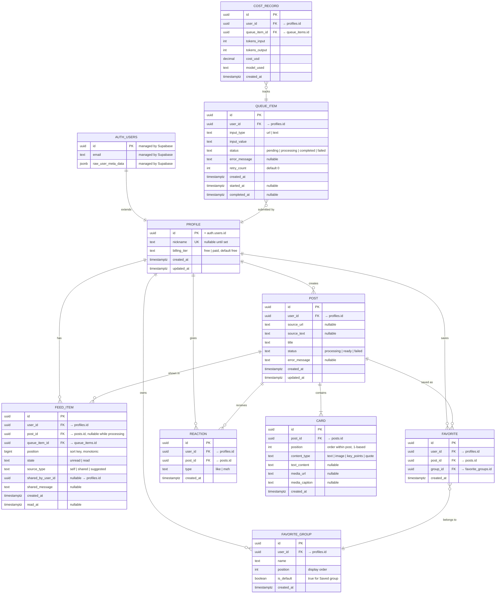

# BrainHeal — Data Model

Status: ✅ Implemented (cross-cutting, dynamic)

## 1. Entity-Relationship Diagram



---

## 2. Supabase-Specific Schema Notes

### `auth.users` ↔ `profiles` Pattern

Supabase manages the `auth.users` table internally. The app creates a `profiles` table in the `public` schema, linked 1:1 via `profiles.id = auth.users.id`. A database trigger auto-creates a profile row on user signup:

```sql
CREATE OR REPLACE FUNCTION public.handle_new_user()
RETURNS trigger AS $$
BEGIN
  INSERT INTO public.profiles (id)
  VALUES (NEW.id);
  RETURN NEW;
END;
$$ LANGUAGE plpgsql SECURITY DEFINER;

CREATE TRIGGER on_auth_user_created
  AFTER INSERT ON auth.users
  FOR EACH ROW
  EXECUTE FUNCTION public.handle_new_user();
```

### Default "Saved" Favorite Group

A second trigger creates the default favorite group when a profile is created:

```sql
CREATE OR REPLACE FUNCTION public.handle_new_profile()
RETURNS trigger AS $$
BEGIN
  INSERT INTO public.favorite_groups (user_id, name, position, is_default)
  VALUES (NEW.id, 'Saved', 0, true);
  RETURN NEW;
END;
$$ LANGUAGE plpgsql SECURITY DEFINER;

CREATE TRIGGER on_profile_created
  AFTER INSERT ON public.profiles
  FOR EACH ROW
  EXECUTE FUNCTION public.handle_new_profile();
```

---

## 3. Key Design Decisions

**Feed ordering:** `FEED_ITEM.position` is a monotonically increasing `bigint`. New items get `max(position) + 1` for that user. Snoozing sets position to `max(position) + 1`, moving the post to the bottom. Feed query: `WHERE state = 'unread' ORDER BY position ASC`.

**Feed item ↔ Queue item linkage:** A `feed_item` is created at ingestion time (with `post_id = NULL`) so the user immediately sees a placeholder in the feed. When the worker completes processing, it sets `feed_item.post_id` to the newly created post. The client detects this change via Supabase Realtime and renders the cards.

**Queue as table:** The `queue_items` table doubles as the processing queue. The Fly.io worker uses `SELECT ... WHERE status = 'pending' ORDER BY created_at ASC LIMIT 1 FOR UPDATE SKIP LOCKED` to claim work without contention. This allows horizontal scaling of workers if needed.

**Soft deletes:** Posts marked as "read" remain in the database (for favorites, reactions, and future search). Only `FEED_ITEM.state` changes to `'read'`.

**Read Next:** `queue_items` includes nullable `parent_post_id` and `parent_card_id` (FKs to `posts` and `cards`, `ON DELETE SET NULL`) for items queued from in-post text or links. `feed_items` includes nullable `parent_post_id` (FK to `posts`) so child rows can be ordered after the parent. The `renormalize_feed_positions(p_user_id uuid)` RPC reassigns unread `feed_items.position` values to consecutive integers `1, 2, 3, …` in sort order when fractional positions need collapsing.

---

## 4. Row Level Security (RLS) Policies

All tables in the `public` schema have RLS enabled. Users can only access their own data. The Fly.io worker uses the `service_role` key, which bypasses RLS.

| Table             | SELECT             | INSERT             | UPDATE                  | DELETE                 |
| ----------------- | ------------------ | ------------------ | ----------------------- | ---------------------- |
| `profiles`        | Own row only       | Auto (trigger)     | Own row only            | —                      |
| `posts`           | Own posts          | — (worker creates) | —                       | Own posts              |
| `cards`           | Cards of own posts | — (worker creates) | —                       | —                      |
| `feed_items`      | Own items          | — (edge function)  | Own items (read/snooze) | Own items              |
| `queue_items`     | Own items          | — (edge function)  | —                       | Own pending items      |
| `favorite_groups` | Own groups         | Own groups         | Own groups              | Own non-default groups |
| `favorites`       | Own favorites      | Own favorites      | —                       | Own favorites          |
| `reactions`       | Own reactions      | Own reactions      | Own reactions           | Own reactions          |
| `cost_records`    | Own records        | — (worker creates) | —                       | —                      |

RLS policy pattern (example for `feed_items`):

```sql
ALTER TABLE feed_items ENABLE ROW LEVEL SECURITY;

CREATE POLICY "Users can view their own feed items"
  ON feed_items FOR SELECT
  USING (auth.uid() = user_id);

CREATE POLICY "Users can update their own feed items"
  ON feed_items FOR UPDATE
  USING (auth.uid() = user_id);
```
