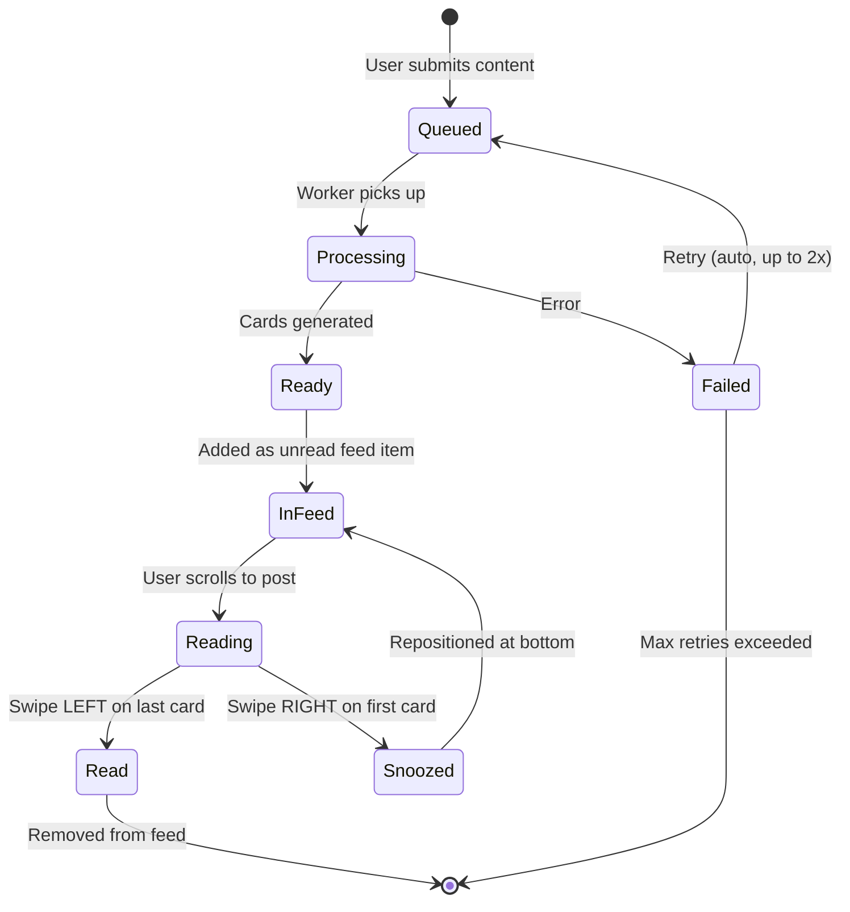
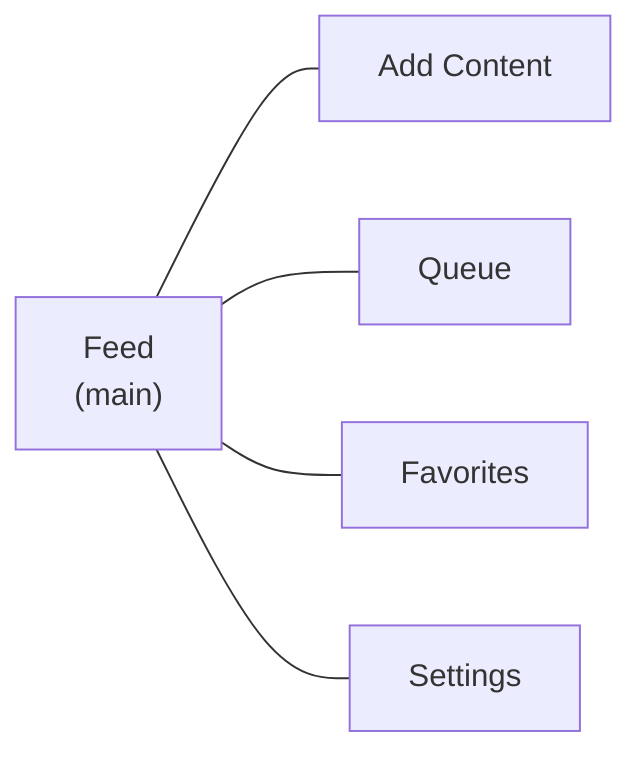

# BrainHeal — Feed, Posts & Cards

## 1. Posts & Cards

A **post** represents a single logical piece of ingested content. A **card** is one screen of information within a post.

### Posts

- One article typically produces one post.
- Long or multi-topic articles may produce multiple posts (decided by the LLM).
- Each post has a title (derived from the source).
- Posts track their source URL (if any), source text, and processing status.

### Cards

- A post contains 1–7 cards (soft limit, configurable globally).
- The **first card** contains the main idea / TL;DR.
- Subsequent cards elaborate: supporting details, examples, context, related info.
- Each card is concise: ~80–150 words of text (must fit on one screen).

### Card Content Types

| Type         | Description                                              |
| ------------ | -------------------------------------------------------- |
| `text`       | Formatted text (the primary type). Rendered as Markdown. |
| `image`      | An image extracted from the article, with optional caption. |
| `key_points` | A structured list of takeaways.                          |
| `quote`      | A notable quote from the source.                         |

Cards do **not** support video embeds in MVP.

---

## 2. Feed

The feed is the main screen of the app. It displays all unread posts in chronological order (oldest first).

### Properties

- **Deterministic**: The order never changes unless the user explicitly snoozes a post.
- **Oldest-first**: Ensures earlier content is consumed before newer content.
- **Unread-only**: Read posts disappear from the feed (accessible via Favorites if saved).

### Navigation

- **Vertical scroll**: Move between posts.
- **Horizontal swipe**: Move between cards within a post.

### Gestures

| Gesture          | Context                         | Effect                                            |
| ---------------- | ------------------------------- | ------------------------------------------------- |
| Swipe LEFT       | On the **last** card of a post  | Mark post as **read** → disappears from feed      |
| Swipe RIGHT      | On the **first** card of a post | **Snooze** → post moves to the bottom of the feed |
| Horizontal swipe | Between first and last card     | Navigate between cards                            |
| Vertical scroll  | Any card                        | Move to next/previous post                        |

### Processing Indicator

Posts still being processed appear in the feed with a skeleton/loading state showing their position in the queue.

### Realtime Updates

When the processing worker finishes generating cards for a post, the feed updates in realtime via Supabase Realtime (WebSocket subscription). The skeleton card is replaced with actual content without requiring a page refresh.

```typescript
supabase
  .channel('feed-updates')
  .on(
    'postgres_changes',
    {
      event: 'UPDATE',
      schema: 'public',
      table: 'feed_items',
      filter: `user_id=eq.${userId}`,
    },
    (payload) => {
      // feed_item was updated (e.g., post_id set)
      // refresh the affected feed item in the UI
    }
  )
  .subscribe();
```

---

## 3. Feed State Machine



---

## 4. Feed Card Layout

```
┌─────────────────────────────┐
│  ← Card 1 of 5 →           │  ← horizontal position indicator
│                             │
│  [Card content area]        │
│  80–150 words of text       │
│  or image with caption      │
│                             │
│                             │
├─────────────────────────────┤
│  ♡  ↗  ★                   │  ← react, share, favorite
│  "Article Title" · source   │
└─────────────────────────────┘
```

- Cards take up the full viewport height (minus navigation chrome).
- Horizontal dots/indicator shows position within the post.
- Action buttons (react, share, favorite) are persistent at the bottom.
- Source URL/topic shown as a subtle footer.

---

## 5. UX Screens

### Screen Map

| Screen                 | Description                                                   | Priority |
| ---------------------- | ------------------------------------------------------------- | -------- |
| **Login / Register**   | Auth flow via Supabase Auth UI or custom form. Minimal steps. | Critical |
| **Feed**               | Main screen. Vertical post scroll, horizontal card swipe.     | Critical |
| **Add Content**        | Input field for URL or text. Accessible via FAB or nav.       | Critical |
| **Processing Queue**   | List of submitted items with status indicators.               | Critical |
| **Favorites**          | Groups sidebar + post list.                                   | Medium   |
| **Settings / Profile** | Account info, nickname, preferences, billing.                 | Medium   |
| **Recommendations**    | Shown at the end of the feed when all content is read.        | Low      |

### Navigation



Bottom navigation bar with 4 tabs: **Feed** (home), **Favorites**, **Queue**, **Settings**. The "Add Content" action is a floating action button (FAB) overlaying the feed, or accessible from the Queue screen.

---

## 6. Feed Data Query

```typescript
const { data } = await supabase
  .from('feed_items')
  .select(`
    id, position, state, source_type, shared_by_user_id, shared_message,
    queue_item:queue_items(status, error_message),
    post:posts(
      id, title, status, source_url, error_message,
      cards(id, position, content_type, text_content, media_url, media_caption)
    )
  `)
  .eq('state', 'unread')
  .order('position', { ascending: true })
  .range(0, 19);
```
