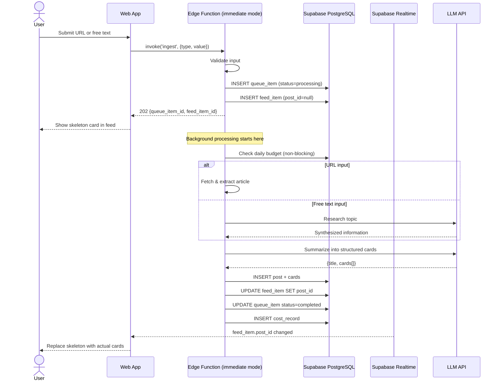

# BrainHeal — Ingestion Modes

Status: ✅ Implemented

## 1. Motivation

The current architecture splits content processing across two services:
- **Edge Function** (`ingest`): Validates input, creates queue_item and feed_item, returns immediately
- **Worker** (Fly.io): Polls queue, processes items (fetch + LLM + save)

This architecture is optimal for production with multiple users, but adds operational complexity and cost for a single-user deployment on Supabase's free tier. The worker requires:
- A separate Fly.io service (~$2-3/month minimum)
- Managing two separate deployments and environments
- Monitoring queue depth and worker health

For a personal instance with low volume (~10-50 items/day), running processing directly in the Edge Function eliminates these operational concerns while staying within Supabase's free tier limits (150s Edge Function timeout, 500K invocations/month).

**Solution:** Support two ingestion modes — **deferred** (current architecture) and **immediate** (self-contained Edge Function processing).

---

## 2. Architecture Overview

```mermaid
graph TB
    subgraph "Deferred Mode (Current)"
        ClientD[Client] -->|POST /ingest| EdgeD[Edge Function]
        EdgeD -->|1. Create queue_item + feed_item| DBD[(Database)]
        EdgeD -->|2. Return 202| ClientD
        Worker[Fly.io Worker] -->|3. Poll queue| DBD
        Worker -->|4. Process + Update| DBD
        DBD -->|5. Realtime update| ClientD
    end

    subgraph "Immediate Mode (New)"
        ClientI[Client] -->|POST /ingest| EdgeI[Edge Function]
        EdgeI -->|1. Create queue_item + feed_item| DBI[(Database)]
        EdgeI -->|2. Return 202| ClientI
        EdgeI -.->|3. Process in background| DBI
        DBI -->|4. Realtime update| ClientI
    end
</mermaid>

---

## 3. Mode Selection

The ingestion mode is controlled by a **single environment variable** in the ingest Edge Function:

```bash
INGESTION_MODE=immediate  # or "deferred" (default)
```

| Mode       | Behavior                                                                                       | Use case                                              |
|------------|------------------------------------------------------------------------------------------------|-------------------------------------------------------|
| `deferred` | Queue item only. Worker processes asynchronously (current behavior).                           | Production, multi-user, horizontal scaling            |
| `immediate`| Queue item, respond immediately, then process in Edge Function background (non-blocking).      | Single-user, low volume, free-tier deployment         |

**Default:** `deferred` (backward compatible).

---

## 4. Immediate Mode — Detailed Flow

### Sequence



### Key Differences from Deferred Mode

| Aspect             | Deferred Mode                     | Immediate Mode                                      |
|--------------------|-----------------------------------|-----------------------------------------------------|
| **Response timing**| After queue insert only           | After queue insert only (same)                      |
| **Processing**     | Separate worker service           | Same Edge Function (background)                     |
| **Budget check**   | Blocking (defer if over budget)   | Non-blocking (log warning, allow processing)        |
| **queue_item status** | `pending` → worker sets `processing` | `processing` immediately (Edge Function owns it) |
| **Timeout**        | No timeout (long-running worker)  | 150s Edge Function timeout (sufficient for most content) |
| **Failure mode**   | Retry via worker poll loop        | Mark as `failed` in queue_item, update feed_item    |

---

## 5. Implementation Changes

### 5.1 Edge Function: `ingest/src/index.ts`

**New environment variable:**
- `INGESTION_MODE`: `'immediate' | 'deferred'` (default: `'deferred'`)

**New shared processing logic:**
- Extract the worker's `processItem()` logic into a shared module that can be used by both:
  - Worker (`worker/src/processor.ts`)
  - Edge Function (`supabase/functions/ingest/src/processor.ts`)
- Shared processing module must:
  - Accept Supabase client, LLM provider, and item context
  - Fetch/extract article or research topic
  - Call LLM to generate cards
  - Insert post + cards
  - Update feed_item and queue_item
  - Record costs

**Changes to POST `/` route:**

```typescript
// After creating queue_item and feed_item, before returning 202:

if (INGESTION_MODE === 'immediate') {
  // Set queue_item status to 'processing' immediately
  await adminClient
    .from('queue_items')
    .update({ status: 'processing', started_at: new Date().toISOString() })
    .eq('id', queueItem.id);

  // Respond to client immediately
  c.res.status = 202;
  c.res.body = JSON.stringify({ queue_item_id: queueItem.id, feed_item_id: feedItem.id });

  // Process in background (non-blocking)
  processInBackground(adminClient, llm, {
    queueItemId: queueItem.id,
    userId: user.id,
    inputType: validated.type,
    inputValue: validated.value,
  }).catch(err => {
    console.error('Background processing failed:', err);
  });

  return c.res;
}

// else: deferred mode — return immediately without processing
return c.json({ queue_item_id: queueItem.id, feed_item_id: feedItem.id }, 202);
```

**Background processing function:**

```typescript
async function processInBackground(
  supabase: SupabaseClient,
  llm: LLMProvider,
  ctx: ItemContext,
): Promise<void> {
  const { queueItemId, userId, inputType, inputValue } = ctx;

  // Check budget (non-blocking — log only)
  try {
    const budgetCheck = await checkDailyBudget(supabase, userId);
    if (!budgetCheck.allowed) {
      console.warn('User over daily budget, but processing anyway (immediate mode)', {
        queue_item_id: queueItemId,
        user_id: userId,
        daily_limit: budgetCheck.dailyLimit,
        today_spend: budgetCheck.todaySpend,
      });
    }
  } catch (err) {
    console.warn('Budget check failed (non-fatal in immediate mode)', { error: String(err) });
  }

  // Process the item
  try {
    await processItem(supabase, llm, ctx);

    // Mark completed
    await supabase
      .from('queue_items')
      .update({ status: 'completed', completed_at: new Date().toISOString() })
      .eq('id', queueItemId);
  } catch (err) {
    const errorMessage = err instanceof Error ? err.message : String(err);
    console.error('Processing failed', { queue_item_id: queueItemId, error: errorMessage });

    // Mark as failed (no retries in immediate mode)
    await supabase
      .from('queue_items')
      .update({
        status: 'failed',
        error_message: errorMessage,
        completed_at: new Date().toISOString(),
      })
      .eq('id', queueItemId);

    // Update any associated post to failed status
    const { data: feedItem } = await supabase
      .from('feed_items')
      .select('post_id')
      .eq('queue_item_id', queueItemId)
      .maybeSingle();

    if (feedItem?.post_id) {
      await supabase
        .from('posts')
        .update({ status: 'failed', error_message: errorMessage })
        .eq('id', feedItem.post_id);
    }
  }
}
```

### 5.2 Shared Processing Module

**Location:** `supabase/functions/_shared/ingest/processor.ts` (or inline in both ingest and worker for simplicity)

**Exports:**
- `processItem(supabase, llm, ctx)`: Core processing logic (fetch + LLM + save)

This module is the current `supabase/functions/_shared/ingest/processor.ts` logic, minus:
- The `processNextItem()` function (worker-specific queue claiming)
- Budget enforcement (moved to caller)

### 5.3 Worker: `worker/src/main.ts`

**No changes required** — worker remains unchanged. In immediate mode, the worker is not deployed or runs idle (queue stays empty).

### 5.4 Budget Behavior

| Mode       | Budget Check Behavior                                                                 |
|------------|---------------------------------------------------------------------------------------|
| `deferred` | **Blocking** — if over budget, revert queue_item to `pending` and skip processing     |
| `immediate`| **Non-blocking** — log warning, allow processing. Costs still recorded for reporting. |

**Rationale for immediate mode non-blocking budget:**
- Single-user free-tier deployments prioritize simplicity and immediate feedback over strict cost control
- User can monitor costs via the admin dashboard and adjust usage manually
- Budget is still calculated and logged for transparency

---

## 6. Frontend Changes

**None.** The frontend is already designed to be agnostic to processing mode:
- Same response format: `{ queue_item_id, feed_item_id }`
- Same Realtime update mechanism: `feed_item.post_id` change
- Same error handling: `queue_items.status='failed'` and `posts.status='failed'`

---

## 7. Configuration & Deployment

### Local Development

Add to `.env.example`:

```bash
# Ingestion mode: 'deferred' (uses worker) or 'immediate' (processes in Edge Function)
# Default: deferred
INGESTION_MODE=immediate
```

### Production

**Supabase Edge Function secret:**

```bash
supabase secrets set INGESTION_MODE=immediate
```

**Fly.io worker:**
- In immediate mode, the worker can be scaled to zero or not deployed at all
- In deferred mode, deploy the worker as usual

---

## 8. Trade-offs

### Immediate Mode

**Pros:**
- Single service (Supabase only) — simpler operations
- No separate worker deployment or cost
- Lower latency for low-volume usage (no polling delay)
- Fits entirely within Supabase free tier for personal use

**Cons:**
- 150s Edge Function timeout (may fail on very long articles or slow LLM responses)
- No automatic retry on transient failures (would need manual retry in frontend)
- No budget enforcement (relies on user monitoring)
- Not suitable for high volume (Edge Function concurrency limits, invocation quotas)

### Deferred Mode

**Pros:**
- No timeout constraints (long-running worker)
- Automatic retry on transient failures
- Budget enforcement (hard limit)
- Horizontal scaling (multiple workers)
- Suitable for production, multi-user deployments

**Cons:**
- Requires separate Fly.io worker (added cost and operational complexity)
- Higher latency (poll interval)

---

## 9. Migration Path

**Backward compatibility:** The default mode is `deferred`, so existing deployments are unaffected.

**Switching from deferred to immediate:**
1. Set `INGESTION_MODE=immediate` in Edge Function environment
2. Scale Fly.io worker to zero or delete the app
3. Existing pending queue_items will not be processed (manual intervention required if any exist)

**Switching from immediate to deferred:**
1. Deploy Fly.io worker
2. Set `INGESTION_MODE=deferred` in Edge Function environment
3. Worker will pick up any pending items from the queue

---

## 10. Testing

### Unit Tests

- `supabase/functions/ingest/src/index_test.ts`:
  - Test immediate mode: verify response is sent before processing completes
  - Test budget check is non-blocking in immediate mode
  - Test error handling in background processing

### Integration Tests

- Submit content in immediate mode, verify:
  - 202 response within <500ms
  - Post + cards appear in feed within Edge Function timeout (150s)
  - Cost record is created
  - Budget warning is logged (if over budget)

### Manual Testing

1. Set `INGESTION_MODE=immediate` locally
2. Submit a URL via the frontend
3. Verify skeleton card appears immediately
4. Verify cards populate within ~10-30s (depending on article length and LLM speed)
5. Check logs for budget check result

---

## 11. Future Enhancements

- **Hybrid mode:** Use immediate mode for small/fast items, defer to worker for large/slow items (based on content length heuristic)
- **Timeout fallback:** If immediate mode processing exceeds 120s, revert queue_item to `pending` and let worker pick it up
- **Budget enforcement in immediate mode:** Add a strict mode flag to block processing if over budget (opt-in)
