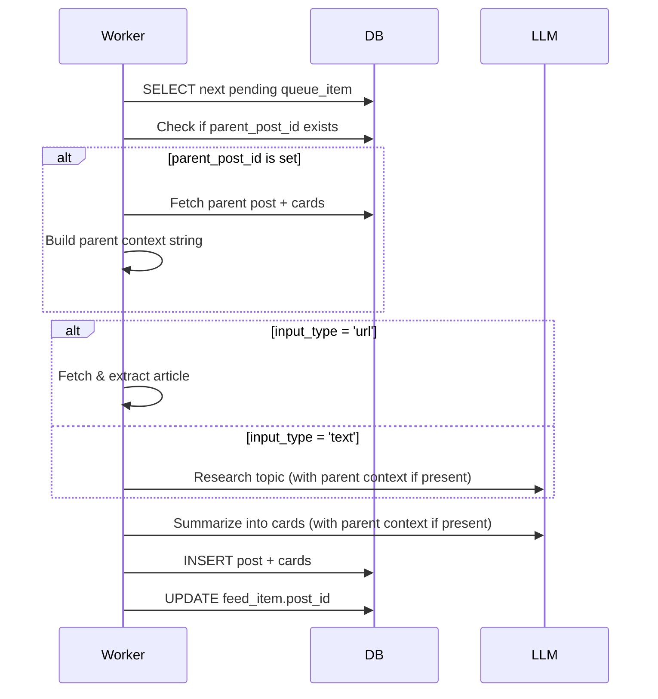

# BrainHeal — Read Next

## 1. Overview

While reading cards, users can select interesting terms or tap links to learn more. The selected content is queued for processing and inserted as a new post immediately after the current post in the feed. This creates an organic, context-aware reading flow.

The feature works for:
- **Text terms**: User selects any text within a card → "Read next" button appears
- **Links**: User taps/hovers a link → "Read next" and "Open in browser" buttons appear

---

## 2. UX — Text Selection

### Selection Detection

When the user selects text within a card:
1. Native browser text selection occurs (highlight, selection handles)
2. A **"Read next"** button appears adjacent to the selection
3. Tapping the button queues the selected text as a free-text topic

### Button Positioning

```
┌─────────────────────────────────┐
│  The algorithm uses an          │
│  amortised O(1)█████████ approach│
│              │ Read next │       │  ← floating button near selection
│  which means...                  │
└─────────────────────────────────┘
```

- Button appears **above** or **beside** the selection (browser-dependent positioning)
- Uses a floating/absolute positioned element that tracks selection bounds
- Disappears when selection is cleared or user taps elsewhere
- No editing capability — the exact selected text is submitted

### Implementation

```typescript
// Detect text selection
document.addEventListener('selectionchange', () => {
  const selection = window.getSelection();
  if (selection && !selection.isCollapsed && selection.toString().trim()) {
    const selectedText = selection.toString().trim();
    const range = selection.getRangeAt(0);
    const rect = range.getBoundingClientRect();
    
    // Show "Read next" button at rect position
    showReadNextButton(selectedText, rect);
  } else {
    hideReadNextButton();
  }
});
```

### Constraints

- **Minimum selection**: 2 characters (prevent accidental single-letter selections)
- **Maximum selection**: 200 characters (prevents selecting entire paragraphs)
- If selection exceeds 200 chars, button shows but is disabled with tooltip: "Selection too long — try a shorter phrase"

---

## 3. UX — Link Interaction

### Link Detection

Links in card markdown are rendered as standard `<a>` tags. On tap/click (mobile) or hover (desktop), a context menu appears with two options.

### Context Menu

```
┌─────────────────────────────────┐
│  Read more about this in the    │
│  [official docs](https://...)   │
│         ┌──────────────────┐    │
│         │ 📖 Read next      │    │
│         │ 🌐 Open in browser│    │
│         └──────────────────┘    │
└─────────────────────────────────┘
```

**Mobile (touch):**
- Tap link → menu appears as a modal/sheet from bottom
- Two large tap targets
- Tap outside or swipe down to dismiss

**Desktop (hover):**
- Hover link → small tooltip/popover appears near cursor
- Click one of the options
- Menu disappears on mouse-out (short delay)

### Implementation

```typescript
// Intercept link clicks in card content
const handleLinkInteraction = (e: MouseEvent | TouchEvent, url: string) => {
  e.preventDefault(); // Don't follow link immediately
  
  showLinkMenu(url, {
    onReadNext: () => queueReadNext(url, 'url', currentPost.id),
    onOpenBrowser: () => window.open(url, '_blank'),
  });
};
```

### Link Behavior

- **"Read next"**: Queues the URL as a new queue item (same as standard URL ingestion)
- **"Open in browser"**: Opens URL in new tab/window (standard `window.open`)
- Both actions dismiss the menu
- No duplicate detection — same link can be queued multiple times

---

## 4. Data Model Changes

### `queue_items` Table

Add two new nullable columns:

```sql
ALTER TABLE queue_items
  ADD COLUMN parent_post_id uuid REFERENCES posts(id) ON DELETE SET NULL;

ALTER TABLE queue_items
  ADD COLUMN parent_card_id uuid REFERENCES cards(id) ON DELETE SET NULL;
```

| Column | Type | Description |
|---|---|---|
| `parent_post_id` | `uuid` (nullable FK) | The post the user was reading when they selected "Read next" |
| `parent_card_id` | `uuid` (nullable FK) | The specific card within that post |

- Both are `NULL` for standard ingestion (content added via main input or share sheet)
- Both are set for "Read next" items
- Used for (1) positioning the resulting post in the feed, (2) providing context to the LLM

### `feed_items` Table

Add one new nullable column:

```sql
ALTER TABLE feed_items
  ADD COLUMN parent_post_id uuid REFERENCES posts(id) ON DELETE SET NULL;
```

| Column | Type | Description |
|---|---|---|
| `parent_post_id` | `uuid` (nullable FK) | The post this feed item is a "Read next" child of |

- Used to determine feed position: the new post appears immediately after its parent
- Enables future features: visual indicators, threading, navigation back to parent

---

## 5. Feed Positioning Logic

### Current Behavior

New posts are added to the end of the feed:
```
position = MAX(position) + 1 WHERE user_id = ...
```

### "Read Next" Positioning

When a `feed_item` is created with a `parent_post_id`:

1. Find the parent's current position:
   ```sql
   SELECT position FROM feed_items 
   WHERE post_id = :parent_post_id AND user_id = :user_id;
   ```

2. Compute new position as **parent position + 0.5**:
   ```sql
   new_position = parent_position + 0.5
   ```

3. Insert the new feed item with `new_position`

This places it immediately after the parent without re-indexing all items.

### Position Renormalization

Over time, positions may accumulate many decimal places. When a user's feed positions drop below 0.1 apart, trigger a renormalization (one-time rewrite with integer gaps):

```sql
-- Renormalize positions: assign 1, 2, 3, ... based on current order
WITH ranked AS (
  SELECT id, ROW_NUMBER() OVER (ORDER BY position ASC) AS new_pos
  FROM feed_items
  WHERE user_id = :user_id AND state = 'unread'
)
UPDATE feed_items
SET position = ranked.new_pos
FROM ranked
WHERE feed_items.id = ranked.id;
```

This can run as a background RPC called by the ingest Edge Function when needed.

---

## 6. Edge Function: `ingest` Changes

The existing `ingest` Edge Function must handle the new `parent_post_id` parameter.

### Updated Request Type

```typescript
type IngestRequest = {
  type: 'url' | 'text';
  value: string;
  parent_post_id?: string; // NEW: optional parent post UUID
  parent_card_id?: string; // NEW: optional parent card UUID
};
```

### Processing Steps

1. **Validate input** (unchanged except for new optional fields)
2. **Get user from JWT** (unchanged)
3. **Check quota** (unchanged, optional in MVP)
4. **INSERT into `queue_items`**:
   ```sql
   INSERT INTO queue_items (user_id, input_type, input_value, parent_post_id, parent_card_id, status)
   VALUES (:user_id, :type, :value, :parent_post_id, :parent_card_id, 'pending');
   ```
5. **Compute feed position**:
   - If `parent_post_id` is provided: use parent position + 0.5
   - If `parent_post_id` is `null`: use MAX(position) + 1 (standard behavior)
6. **INSERT into `feed_items`**:
   ```sql
   INSERT INTO feed_items (user_id, queue_item_id, parent_post_id, position, state)
   VALUES (:user_id, :queue_item_id, :parent_post_id, :position, 'unread');
   ```
7. **Return** `{ queue_item_id, feed_item_id }` (unchanged)

### Feed Position Query

```typescript
let position: number;

if (parent_post_id) {
  // Find parent's current position
  const { data } = await supabase
    .from('feed_items')
    .select('position')
    .eq('post_id', parent_post_id)
    .eq('user_id', user_id)
    .single();
  
  if (data) {
    position = data.position + 0.5;
  } else {
    // Parent not found (may have been read/deleted) — fall back to end of feed
    position = await getMaxPosition(user_id) + 1;
  }
} else {
  // Standard ingestion — add to end
  position = await getMaxPosition(user_id) + 1;
}
```

---

## 7. Worker Processing Changes

### Context Assembly

When processing a queue item with `parent_post_id` and `parent_card_id`:

1. **Fetch parent post + cards**:
   ```typescript
   const { data: parentPost } = await supabase
     .from('posts')
     .select('id, title, cards(position, text_content)')
     .eq('id', queueItem.parent_post_id)
     .single();
   ```

2. **Build context string**:
   ```typescript
   const parentContext = `
   Parent Post Title: ${parentPost.title}
   
   Parent Post Content:
   ${parentPost.cards.map(c => c.text_content).join('\n\n')}
   `;
   ```

3. **Pass context to LLM** (see §8)

### Processing Flow



---

## 8. LLM Prompt Changes

### System Prompt Addition

When a queue item has a parent, prepend context to the system prompt:

```
You are summarizing content for a user who is reading about a related topic.

The user was reading this post:
---
Title: {parent_post.title}

{parent_post.cards[].text_content joined with newlines}
---

The user selected "{queue_item.input_value}" to learn more.

Your task: summarize the requested content ({queue_item.input_type}) in the context of what they were reading. Assume they already understand the basics from the parent post. Focus on:
- Direct answers to what the selected term/link means
- How it relates to the parent topic
- Additional depth or examples

Follow the standard card generation rules: 2–7 cards, 80–150 words per card, first card is TL;DR.
```

### For URL Inputs

If `input_type = 'url'` and `parent_post_id` is set:

```
Parent context:
{parent_context}

Now summarize this article: {fetched_article_text}

Focus on aspects relevant to the parent topic above.
```

### For Text Inputs

If `input_type = 'text'` and `parent_post_id` is set:

```
Parent context:
{parent_context}

The user selected this term/phrase: "{input_value}"

First, research what this means in the context of the parent topic.
Then, summarize your findings into cards.
```

---

## 9. Frontend Implementation

### Text Selection Handler

```typescript
// In the Card component
useEffect(() => {
  const handleSelectionChange = () => {
    const selection = window.getSelection();
    if (!selection || selection.isCollapsed) {
      setShowReadNextButton(false);
      return;
    }
    
    const selectedText = selection.toString().trim();
    if (selectedText.length < 2 || selectedText.length > 200) {
      setShowReadNextButton(false);
      return;
    }
    
    const range = selection.getRangeAt(0);
    const rect = range.getBoundingClientRect();
    
    setReadNextButtonPosition(rect);
    setSelectedText(selectedText);
    setShowReadNextButton(true);
  };
  
  document.addEventListener('selectionchange', handleSelectionChange);
  return () => document.removeEventListener('selectionchange', handleSelectionChange);
}, []);

const handleReadNextClick = async () => {
  await supabase.functions.invoke('ingest', {
    body: {
      type: 'text',
      value: selectedText,
      parent_post_id: currentPost.id,
      parent_card_id: currentCard.id,
    },
  });
  
  // Clear selection
  window.getSelection()?.removeAllRanges();
  setShowReadNextButton(false);
  
  // Show success toast
  toast.success('Added to your feed');
};
```

### Link Handler

```typescript
// In the Card markdown renderer
const LinkComponent = ({ href, children }: { href: string; children: React.ReactNode }) => {
  const [showMenu, setShowMenu] = useState(false);
  const [menuPosition, setMenuPosition] = useState({ x: 0, y: 0 });
  
  const handleClick = (e: React.MouseEvent) => {
    e.preventDefault();
    
    const rect = e.currentTarget.getBoundingClientRect();
    setMenuPosition({ x: rect.left, y: rect.bottom + 5 });
    setShowMenu(true);
  };
  
  const handleReadNext = async () => {
    await supabase.functions.invoke('ingest', {
      body: {
        type: 'url',
        value: href,
        parent_post_id: currentPost.id,
        parent_card_id: currentCard.id,
      },
    });
    
    setShowMenu(false);
    toast.success('Added to your feed');
  };
  
  const handleOpenBrowser = () => {
    window.open(href, '_blank', 'noopener,noreferrer');
    setShowMenu(false);
  };
  
  return (
    <>
      <a href={href} onClick={handleClick}>
        {children}
      </a>
      
      {showMenu && (
        <LinkContextMenu
          position={menuPosition}
          onReadNext={handleReadNext}
          onOpenBrowser={handleOpenBrowser}
          onDismiss={() => setShowMenu(false)}
        />
      )}
    </>
  );
};
```

### Mobile Touch Handling

For mobile, use a bottom sheet instead of a positioned popover:

```typescript
const LinkContextMenu = ({ onReadNext, onOpenBrowser, onDismiss }: Props) => {
  const isMobile = useMediaQuery('(max-width: 768px)');
  
  if (isMobile) {
    return (
      <BottomSheet onDismiss={onDismiss}>
        <button onClick={onReadNext}>
          📖 Read next
        </button>
        <button onClick={onOpenBrowser}>
          🌐 Open in browser
        </button>
      </BottomSheet>
    );
  }
  
  return (
    <Popover position={position}>
      <button onClick={onReadNext}>📖 Read next</button>
      <button onClick={onOpenBrowser}>🌐 Open in browser</button>
    </Popover>
  );
};
```

---

## 10. Edge Cases & Constraints

| Scenario | Behavior |
|---|---|
| Parent post is marked as read before child is processed | Child post is still created; appears at the end of the feed (fallback positioning) |
| Parent post is deleted before child is processed | `parent_post_id` is set to `NULL` via `ON DELETE SET NULL`; processing continues normally |
| User selects text that is already a pending queue item | No duplicate detection — new queue item is created |
| User taps "Read next" on the same link multiple times | No duplicate detection — multiple queue items are created |
| Selected text contains only whitespace | Button does not appear (validation: `trim().length` check) |
| Selected text is 1 character | Button does not appear (minimum 2 chars) |
| Selected text is >200 characters | Button appears but is disabled with tooltip |
| Link is invalid/malformed URL | Standard ingestion error handling applies (queue item fails, error shown in queue view) |
| User selects text across multiple cards | Selection is valid if within the overall post container; `parent_card_id` is the card where selection started |

---

## 11. Security & Validation

### Input Validation

Edge Function validates:
- `type` is `'url'` or `'text'`
- `value` length: 1–5000 characters
- `parent_post_id` and `parent_card_id` (if provided) are valid UUIDs
- **Ownership check**: if `parent_post_id` is provided, verify the post belongs to the authenticated user:
  ```typescript
  const { data } = await supabase
    .from('posts')
    .select('user_id')
    .eq('id', parent_post_id)
    .single();
  
  if (!data || data.user_id !== auth.uid()) {
    return c.json({ error: 'Invalid parent post' }, 403);
  }
  ```

### RLS Policies

No RLS changes needed — existing policies already cover the new columns:
- `queue_items`: users can only insert their own rows (`user_id = auth.uid()`)
- `feed_items`: users can only insert their own rows
- `posts`/`cards`: users can only read their own data

---

## 12. Realtime Updates

No changes needed — existing Realtime subscription on `feed_items` already handles updates:

```typescript
supabase
  .channel('feed-updates')
  .on(
    'postgres_changes',
    { event: 'UPDATE', schema: 'public', table: 'feed_items', filter: `user_id=eq.${userId}` },
    (payload) => {
      // feed_item.post_id was set by worker → refresh UI
    }
  )
  .subscribe();
```

When a "Read next" item finishes processing, the client receives the update and renders the new post in its correct position (immediately after the parent).

---

## 13. Future Enhancements

| Enhancement | Description | Complexity |
|---|---|---|
| **Visual threading** | Show a subtle line or indent connecting child posts to parents | Low |
| **Parent navigation** | Tap a "Read next" post footer to jump back to the parent post | Low |
| **Duplicate detection** | Warn user if selecting a term/link that's already queued or processed | Medium |
| **Editable selection** | Allow user to edit selected text before submitting (e.g., add context like "What does X mean?") | Medium |
| **Smart context truncation** | If parent post is very long, send only the relevant card's content as context | Medium |
| **Priority queue** | Allow "Read next" items to jump the queue for faster processing | Low |
| **Collapsible threads** | Collapse/expand "Read next" children in the feed | High |

---

## 14. Testing Checklist

### Manual Testing

- [ ] Select text in a card → "Read next" button appears
- [ ] Tap "Read next" → queue item created, success toast shown
- [ ] Verify queue item has correct `parent_post_id` and `parent_card_id`
- [ ] Verify feed item has correct `parent_post_id`
- [ ] Verify new post appears immediately after parent in feed
- [ ] Tap link in card → menu appears with two options
- [ ] Tap "Read next" → URL queued with parent context
- [ ] Tap "Open in browser" → URL opens in new tab
- [ ] Worker processes "Read next" item → parent context included in LLM prompt
- [ ] Verify generated cards are contextually relevant to parent
- [ ] Mark parent as read, then child finishes processing → child appears at end of feed
- [ ] Delete parent, then child finishes processing → no error, child processed normally

### Edge Cases

- [ ] Select 1 character → button does not appear
- [ ] Select 201 characters → button disabled with tooltip
- [ ] Select whitespace only → button does not appear
- [ ] Select text across multiple cards → works correctly
- [ ] Tap "Read next" on external link (http://) → queued as URL
- [ ] Tap "Read next" on relative link (#anchor) → validation error or fallback
- [ ] Rapid-fire selections → all queue items created (no deduplication)
- [ ] Parent has position 5.5 → child gets position 6.0 (5.5 + 0.5)
- [ ] Feed has positions 1.999, 2.000, 2.001 → renormalization triggered

### Integration Testing

- [ ] "Read next" + standard ingestion mixed in queue → processed in FIFO order
- [ ] "Read next" works with free-tier user (not gated)
- [ ] "Read next" works when daily budget is near limit
- [ ] Realtime updates work for "Read next" items
- [ ] RLS policies correctly enforce ownership on parent posts

---

## 15. Migration Plan

### Database Migration

```sql
-- File: supabase/migrations/<timestamp>_add_read_next.sql

-- Add parent tracking to queue_items
ALTER TABLE queue_items
  ADD COLUMN parent_post_id uuid REFERENCES posts(id) ON DELETE SET NULL,
  ADD COLUMN parent_card_id uuid REFERENCES cards(id) ON DELETE SET NULL;

-- Add parent tracking to feed_items
ALTER TABLE feed_items
  ADD COLUMN parent_post_id uuid REFERENCES posts(id) ON DELETE SET NULL;

-- Create index for faster parent lookups
CREATE INDEX idx_feed_items_parent_post ON feed_items(parent_post_id) WHERE parent_post_id IS NOT NULL;
CREATE INDEX idx_queue_items_parent_post ON queue_items(parent_post_id) WHERE parent_post_id IS NOT NULL;

-- Positions will naturally accumulate decimals; no immediate action needed
-- Renormalization can be a manual RPC called on-demand or scheduled
```

### Rollout Steps

1. **Deploy migration** — add columns (non-breaking, nullable)
2. **Deploy worker changes** — handle new columns, provide context to LLM
3. **Deploy Edge Function changes** — accept new parameters, compute positioning
4. **Deploy frontend changes** — text selection handler, link context menu
5. **Test end-to-end** with staging environment
6. **Production deployment** — feature enabled immediately (no feature flag needed)

### Rollback Plan

If issues arise:
- Frontend: remove selection/link handlers (users can't trigger feature)
- Backend: worker ignores `parent_post_id` and processes items normally
- Database: columns remain (safe to leave; no data corruption)
